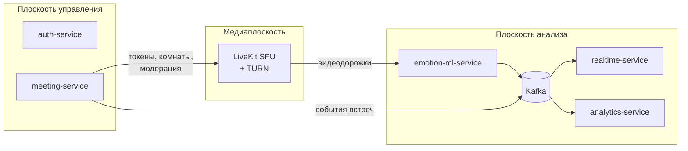
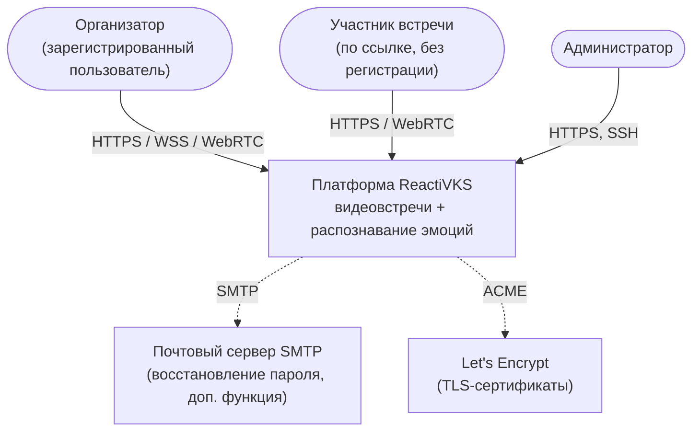

# 1. Обзор архитектуры

## 1.1 Назначение Системы

Система – собственная веб-платформа видеовстреч (до 10 участников), в которой видеопоток каждого участника,
давшего согласие, анализируется моделью распознавания выражений лица. Организатор в реальном времени видит
эмоции каждого собеседника (7 классов: радость, грусть, гнев, страх, удивление, отвращение, нейтральное
состояние), а по завершении встречи получает отчет с динамикой эмоций.

Архитектура должна обеспечить три вещи одновременно:

1. **Видеосвязь** реального времени в браузере без установки программ (WebRTC через SFU).
2. **Анализ** видео участников на сервере с задержкой отображения ≤ 2 с.
3. **Прозрачность и приватность**: анализ только с согласия, кадры не сохраняются, результаты видит только организатор.

## 1.2 Архитектурные драйверы

### Ключевые функциональные требования

| ID | Функция (концепция, разд. 6) | Архитектурное следствие |
|---|---|---|
| F-1 | Регистрация и аутентификация (6.1) | Отдельный сервис учетных записей, JWT |
| F-2 | Создание встречи, ссылка-приглашение (6.2) | Сервис встреч, вход гостя без регистрации |
| F-3 | Видеовстреча до 10 участников (6.3) | Готовый SFU (LiveKit), клиентский SDK |
| F-4 | Согласие на анализ (6.4) | Серверный источник истины о согласии; ML получает только разрешенные дорожки |
| F-5 | Распознавание эмоций (6.5) | ML-сервис – служебный участник комнаты, подписывается на видеодорожки |
| F-6 | Панель эмоций ≤ 2 с (6.6) | Потоковая доставка результатов через шину событий и WebSocket |
| F-7 | Отчет по встрече (6.7) | Сервис аналитики с хранением временных рядов |
| F-8…F-11 | История, экспорт, настройки, администрирование (6.8–6.11) | REST API сервисов, генерация PDF/CSV, эндпоинты состояния |

### Нефункциональные требования и механизмы их обеспечения

| Требование (концепция, 8.6) | Значение | Механизм |
|---|---|---|
| Задержка аудио/видео | ≤ 400 мс | SFU без перекодирования, UDP, simulcast, адаптивный битрейт LiveKit |
| Участников во встрече / встреч одновременно | ≥ 10 / ≥ 5 | LiveKit, горизонтально масштабируемый ML-воркер (диспетчеризация заданий LiveKit Agents) |
| Задержка результатов анализа | ≤ 2 с | Обработка «последнего кадра» без очереди, Kafka, WebSocket-push; бюджет задержки – см. 1.5 |
| Частота анализа | ≥ 2 кадра/с на участника | Семплирование 2–5 кадров/с, пакетный инференс ONNX Runtime, адаптивное снижение частоты |
| Точность | accuracy ≥ 65 % (7 классов) | Отдельный конвейер обучения `ml/training`, карточка модели, замена модели без изменения кода сервиса |
| Время подключения по ссылке | ≤ 5 с | Одна REST-операция входа возвращает токен LiveKit; прямое подключение к SFU |
| Надежность | Сбой ML не прерывает встречу | ML изолирован в отдельном сервисе; медиатракт от него не зависит; статус анализа отдается организатору |
| Восстановление соединения | Автоматическое | Встроенный reconnect LiveKit SDK |
| Безопасность | TLS 1.2+, DTLS-SRTP, bcrypt/Argon2 | Nginx (TLS), WebRTC (DTLS-SRTP), Argon2id в auth-service, короткоживущие токены |
| Приватность | Кадры не сохраняются | Кадры только в памяти ML-сервиса; в БД – посекундные агрегаты ([ADR-009](../adr/ADR-009-emotion-data-retention.md)) |
| Переносимость | Развертывание одной командой | Docker Compose, конфигурация через переменные окружения |
| Сопровождаемость | Замена модели или медиасервера | Интерфейс `EmotionClassifier`; взаимодействие с LiveKit сосредоточено в meeting-service и адаптере ML-сервиса |
| Тестируемость | Покрытие серверного кода ≥ 60 % | pytest + testcontainers, контрактные тесты событий |

### Ограничения

- Команда 3 человека, ≈ 310 чел.-ч, срок – 25.12.2026, MVP – 04.12.2026.
- Бюджета нет: только свободное ПО; один демонстрационный сервер (8 vCPU, 16 ГБ, без GPU).
- Медиасервер не разрабатывается с нуля.
- Запись встреч и мобильные клиенты в первой версии не поддерживаются.
- Серверная часть на Python 3.12 (FastAPI), клиентская – TypeScript/React.

## 1.3 Архитектурный стиль

Система построена как **набор микросервисов** ([ADR-001](../adr/ADR-001-microservices.md)), объединенных:

- **синхронным REST** – для запросов клиента (через Nginx) и немногочисленных внутренних вызовов;
- **асинхронной шиной событий Apache Kafka** ([ADR-012](../adr/ADR-012-kafka.md)) – для результатов анализа и событий жизненного цикла встреч;
- **медиаплоскостью LiveKit** ([ADR-002](../adr/ADR-002-livekit.md)) – для аудио, видео, чата и доставки видеодорожек в ML-сервис.

Плоскости разделены: отказ плоскости анализа (ML, шина, realtime, analytics) не влияет на медиаплоскость и видеосвязь.

## 1.4 Контекст Системы (C4, уровень 1)

Интеграции со сторонними платформами ВКС, облачными API распознавания и внешними хранилищами нет:
все вычисления выполняются на собственном сервере, что упрощает соблюдение 152-ФЗ.

## 1.5 Бюджет задержки панели эмоций

Цель – ≤ 2 с от изменения мимики до обновления панели.

| Этап | Оценка |
|---|---|
| Камера → SFU → ML-сервис (WebRTC) | 100–300 мс |
| Ожидание очередного такта семплирования (3 кадра/с) | 0–333 мс |
| Декодирование + детекция + классификация (CPU, пакет до 10 лиц) | 50–250 мс |
| Сглаживание (EMA, эффективное окно ≈ 1 с) | вносит инерцию ≈ 0,5–1 с |
| ML → Kafka (`linger.ms=20`) → realtime-service (`fetch.max.wait.ms=50`) → WebSocket → браузер | 30–120 мс |
| Отрисовка | < 50 мс |
| **Итого** | **≈ 0,7–2,0 с** |

Главный регулятор – коэффициент сглаживания и частота семплирования; оба задаются конфигурацией ML-сервиса.

## 1.6 Сознательно не входит в первую версию

Запись встреч, анализ голоса, оценка вовлеченности по взгляду, режим вебинара, интеграция с календарями,
мобильные приложения, зал ожидания, демонстрация экрана (дополнительная функция – LiveKit поддерживает ее без
изменений архитектуры, реализуется при наличии времени). Архитектура не препятствует их добавлению:
запись – через LiveKit Egress, анализ голоса – подписка ML-агента на аудиодорожки.
