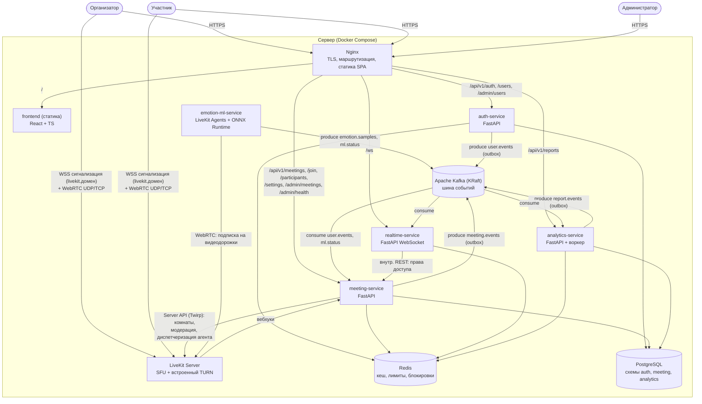

# 2. Состав и взаимодействие сервисов (C4, уровень 2)

## 2.1 Диаграмма контейнеров

## 2.2 Перечень сервисов

| Сервис | Тип | Порт (внутр.) | Технологии | Ответственность | Хранилище |
|---|---|---|---|---|---|
| **frontend** | SPA (статика) | – | React, TS, Vite, livekit-client | Весь пользовательский интерфейс | localStorage (настройки устройств) |
| **auth-service** | HTTP API | 8001 | FastAPI, SQLAlchemy, Argon2, PyJWT, aiokafka | Регистрация, вход, refresh-токены, выпуск JWT, JWKS, управление учетными записями (админ) | схема `auth` |
| **meeting-service** | HTTP API | 8002 | FastAPI, SQLAlchemy, livekit-api, aiokafka | Встречи, приглашения, участники, согласия, токены LiveKit, модерация, вебхуки LiveKit, запуск ML-агента, настройки организатора | схема `meeting` |
| **realtime-service** | WebSocket | 8003 | FastAPI (WebSocket), aiokafka, redis-py | Доставка организатору результатов анализа, статусов участников и анализа, уведомлений в реальном времени | – (состояние в памяти, кеш в Redis) |
| **analytics-service** | HTTP API + фоновый потребитель | 8004 | FastAPI, SQLAlchemy, aiokafka, pandas, WeasyPrint, matplotlib | Сохранение посекундных рядов, отметки, построение отчета, экспорт PDF/CSV, удаление данных | схема `analytics` |
| **emotion-ml-service** | Воркер | 8005 (только health/metrics) | livekit-agents, OpenCV, ONNX Runtime, NumPy, aiokafka | Получение видеодорожек, детекция лица, классификация эмоций, сглаживание, публикация результатов | – (без состояния) |
| **LiveKit Server** | SFU (готовый) | 7880 (WS/API), 7881/tcp, 7882/udp, 3478/udp, 5349/tcp | LiveKit OSS | Медиатрафик, сигнализация WebRTC, TURN, data-сообщения (чат) | – |
| **Nginx** | Шлюз | 80, 443 | Nginx | TLS-терминация, маршрутизация, статика, ограничения частоты запросов | – |
| **Apache Kafka** | Брокер событий | 9092 (клиенты), 9093 (контроллер KRaft) | Kafka 3.9 / 4.x, KRaft, 1 брокер | Топики событий ([events.md](../api/events.md)) | том `kafkadata` |
| **PostgreSQL 16** | СУБД | 5432 | – | Данные сервисов | том `pgdata` |
| **Redis 7** | Кеш | 6379 | – | Кеш прав доступа, лимиты запросов, ключи идемпотентности, блокировки фоновых задач | без постоянного хранения |

Подробное описание каждого сервиса – в каталогах [backend/](../backend/) и [ml/](../ml/), клиентской части – [frontend/](../frontend/README.md).

## 2.3 Границы ответственности (владение данными)

| Сущность | Владелец (источник истины) | Кто еще использует и как |
|---|---|---|
| Пользователь, роль, статус блокировки | auth-service | Остальные сервисы – через claims JWT (`sub`, `role`); meeting, analytics – события `user.events` |
| Встреча, код приглашения, статус встречи | meeting-service | analytics – локальная проекция из `meeting.events`; realtime – внутренний REST с кешем |
| Участник, отображаемое имя | meeting-service | analytics – проекция из `meeting.events`; ML – атрибуты участника LiveKit |
| Согласие на анализ | meeting-service (журнал согласий) | ML – атрибут `vks.consent` в LiveKit; realtime/analytics – событие `consent.changed` |
| Комната, медиадорожки | LiveKit (эфемерно) | meeting-service – через Server API и вебхуки |
| Отсчеты эмоций (поток) | emotion-ml-service (эфемерно, топик `emotion.samples`, хранение 1 ч) | realtime – трансляция; analytics – агрегация |
| Временные ряды, отметки, отчеты | analytics-service | frontend – через REST |

Правило: сервис **не читает чужую схему БД**. Данные другого сервиса получаются из событий (проекции) или через API.

## 2.4 Матрица взаимодействий

| Откуда → Куда | Способ | Назначение |
|---|---|---|
| Браузер → Nginx → сервисы | HTTPS REST (JSON), OpenAPI 3.1 | Все пользовательские операции |
| Браузер организатора → realtime-service | WSS `/ws` | Панель эмоций, уведомления ([протокол](../api/websocket-protocol.md)) |
| Браузер → LiveKit | WSS (сигнализация) + WebRTC (DTLS-SRTP) | Аудио, видео, чат (data-сообщения) |
| meeting-service → LiveKit | HTTP Server API (Twirp) | Создание/удаление комнат, обновление атрибутов участников, mute/remove, диспетчеризация агента |
| LiveKit → meeting-service | HTTP вебхуки (подпись JWT) | `participant_joined/left`, `room_finished` |
| emotion-ml-service ↔ LiveKit | Протокол LiveKit Agents (WSS) + WebRTC | Получение заданий, подписка на видеодорожки |
| emotion-ml-service → Kafka | produce | `emotion.samples`, `ml.status` |
| auth-, meeting-, analytics-service → Kafka | produce через outbox | `user.events`, `meeting.events`, `report.events` |
| Kafka → realtime-, analytics-, meeting-service | consume (группы потребителей) | Независимая обработка одних и тех же событий |
| realtime-service → meeting-service | внутренний REST `/internal/*` | Проверка, что пользователь – организатор встречи |
| analytics-service → meeting-service | внутренний REST `/internal/*` | Досинхронизация проекции (при потере событий) |

Внутренние эндпоинты `/internal/*` не маршрутизируются Nginx и требуют заголовок `X-Service-Token`
([05-security-privacy.md](05-security-privacy.md)).

## 2.5 Поведение при отказах

| Отказ | Последствие | Реакция Системы |
|---|---|---|
| emotion-ml-service | Нет новых отсчетов | Видеосвязь продолжается; realtime-service по отсутствию heartbeat в `ml.status` (> 10 с) отправляет организатору `analysis.status = unavailable`; при восстановлении LiveKit переназначает задание агенту |
| realtime-service | Панель не обновляется | Видеосвязь и сохранение рядов (analytics) продолжаются; клиент переподключается с экспоненциальной задержкой |
| analytics-service | Ряды не пишутся | События остаются в Kafka (`emotion.samples` – 1 ч, остальные – 7 сут); после рестарта потребитель дочитывает с последнего зафиксированного смещения |
| Kafka | Нет анализа в реальном времени и новых отчетов | Видеосвязь продолжается; ML отбрасывает отсчеты (`ml.status degraded` в журнале); события auth/meeting/analytics копятся в outbox и публикуются после восстановления; организатор видит «анализ недоступен» |
| Redis | Нет кеша и лимитов | Проверка прав realtime – напрямую в meeting-service; ограничение частоты – только в Nginx; фоновые задачи пропускают запуски (нет блокировки) |
| meeting-service | Нельзя создать встречу или войти в нее | Уже идущие встречи продолжаются (соединения с LiveKit установлены) |
| auth-service | Нельзя войти | Уже выданные access-токены действуют до истечения (15 мин) |
| LiveKit | Встречи прерываются | Критический компонент; перезапуск Docker (`restart: unless-stopped`), клиенты переподключаются |
| PostgreSQL | Большинство операций REST недоступно | Критический компонент; ежедневные резервные копии |
