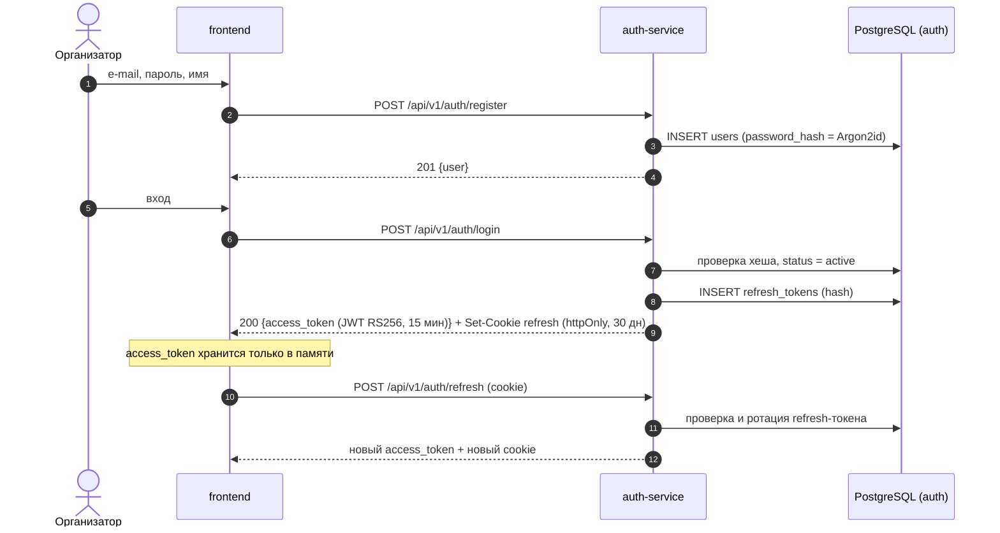
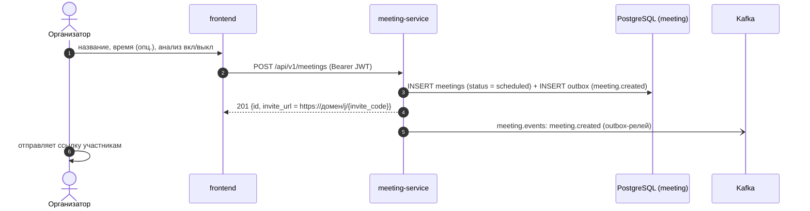
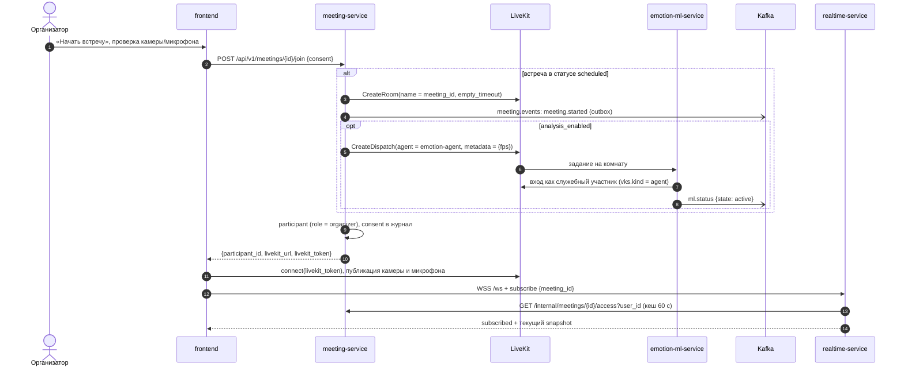
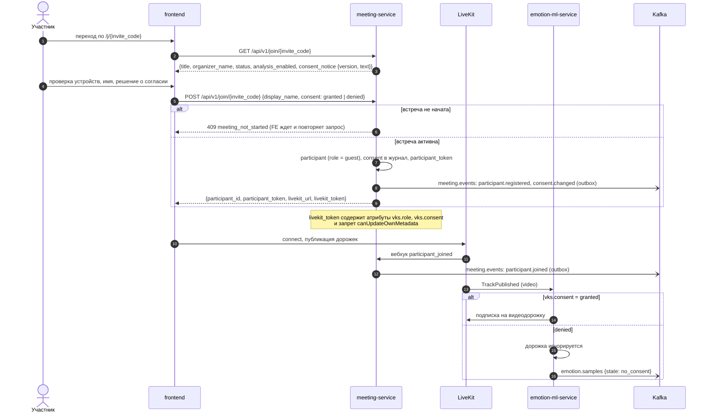
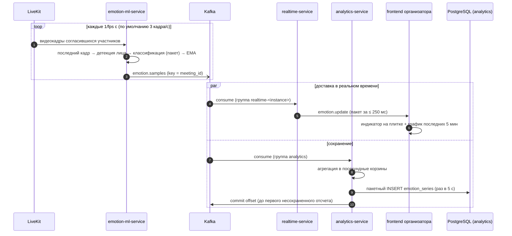
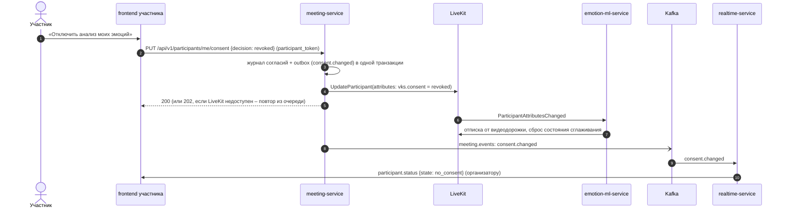
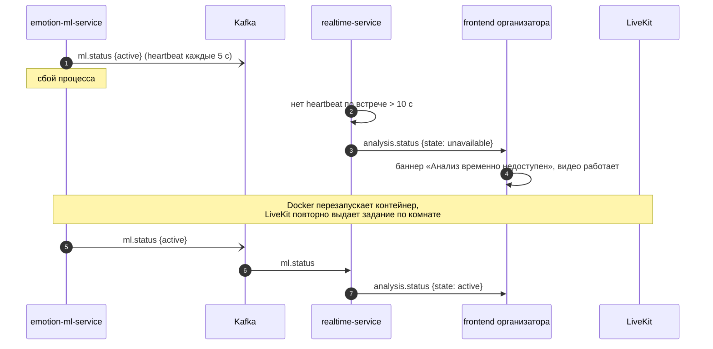
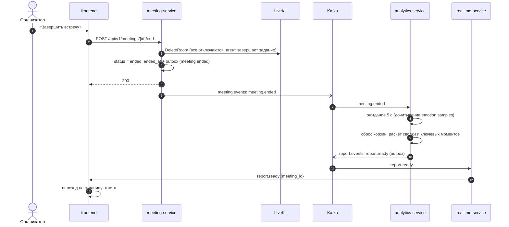
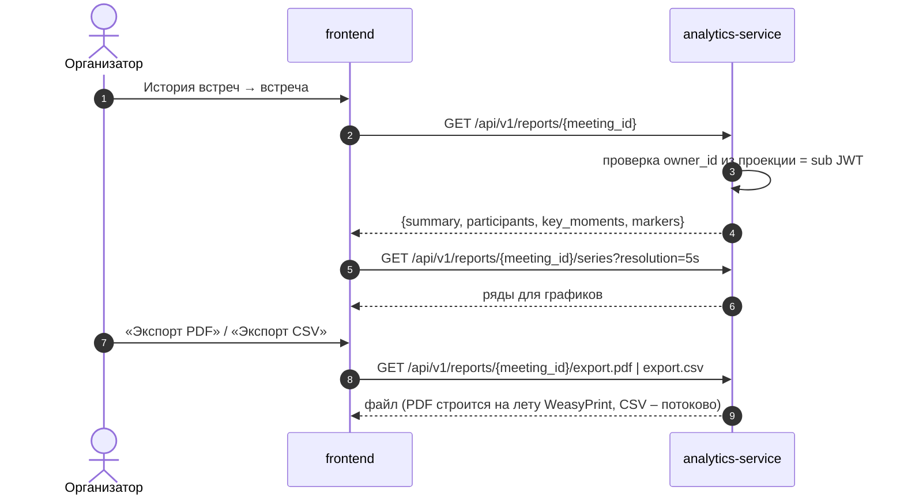
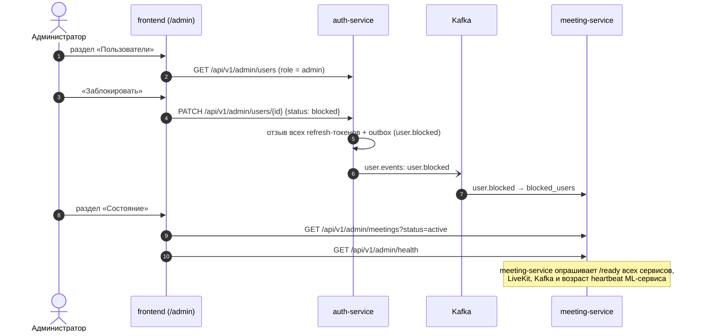

# 3. Ключевые сценарии

Сценарии соответствуют прецедентам документа-концепции (раздел 7). Пути REST приведены сокращенно,
полное описание – в [api/rest-api.md](../api/rest-api.md).

Обозначение «→ Kafka (outbox)» означает: событие записывается в таблицу `outbox` в той же транзакции, что и данные,
и публикуется в Kafka фоновым релеем в течение ≤ 1 с ([ADR-011](../adr/ADR-011-transactional-outbox.md)).

## 3.1 UC-1. Регистрация, вход, обновление токена

Повторное предъявление уже использованного refresh-токена считается компрометацией: отзываются все
refresh-токены пользователя.

## 3.2 UC-2. Создание встречи

Создание и отправка приглашения укладываются в 3 действия: «Новая встреча» → «Создать» → «Копировать ссылку».

## 3.3 UC-4 (начало). Организатор запускает встречу

## 3.4 UC-3. Участник присоединяется по ссылке

Альтернативный сценарий 4а (NAT, межсетевой экран): клиент LiveKit перебирает ICE-кандидатов
(UDP 7882 → TCP 7881 → TURN/UDP 3478 → TURN/TLS 443 через `turn.<домен>`); логика приложения не меняется.

## 3.5 UC-4. Анализ эмоций и панель организатора

Альтернативный сценарий 6а: лицо не найдено → отсчет с `state = no_face`, на панели – «лицо не обнаружено».

## 3.6 UC-4. Отзыв согласия во время встречи

Повторное согласие (`granted`) выполняется тем же запросом. Отзыв согласия не удаляет уже накопленные данные
автоматически; удаление данных встречи – право организатора (UC-5), а участник может запросить его у организатора
или администратора (см. [05-security-privacy.md](05-security-privacy.md)).

## 3.7 UC-4. Недоступность ML-сервиса (альтернативный сценарий 5а)

Тот же сценарий срабатывает при недоступности Kafka: heartbeat не доходит до realtime-service, организатор видит
«анализ недоступен», видеосвязь не затрагивается.

## 3.8 UC-4 (завершение). Окончание встречи и формирование отчета

Встреча завершается и без организатора: если комната пуста дольше `empty_timeout` (5 мин), LiveKit закрывает ее
и присылает вебхук `room_finished`, после чего meeting-service выполняет те же шаги начиная с `status = ended`.

`meeting.ended` и отсчеты идут в разных топиках, поэтому analytics-service ждет 5 с и дополнительно проверяет, что
отставание группы `analytics` по `emotion.samples` для партиции этой встречи меньше 1 с; иначе ждет еще (до 60 с).

## 3.9 UC-5, UC-6. Просмотр отчета и экспорт

## 3.10 UC-7. Администрирование

Журналы ошибок просматриваются в Grafana/Loki (профиль мониторинга) или через `docker compose logs`
– см. [06-deployment.md](06-deployment.md).
