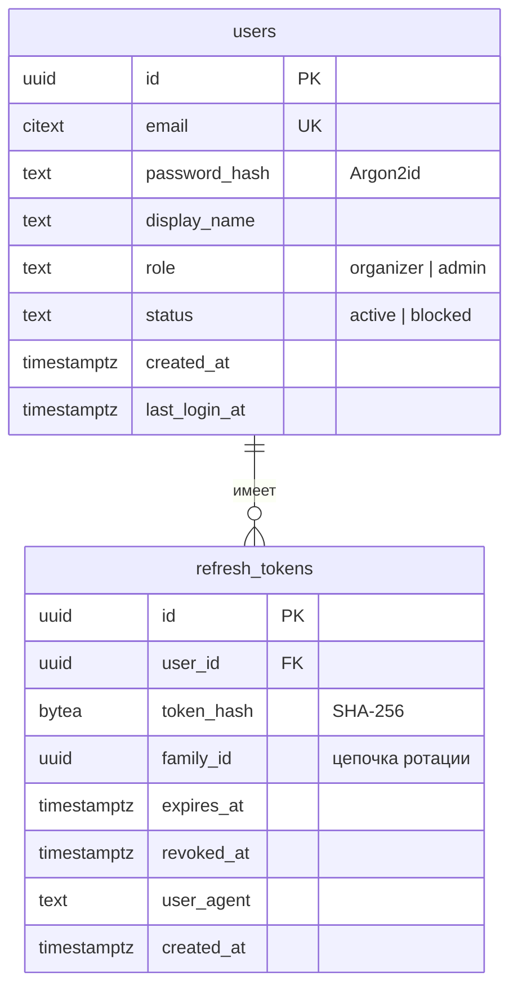
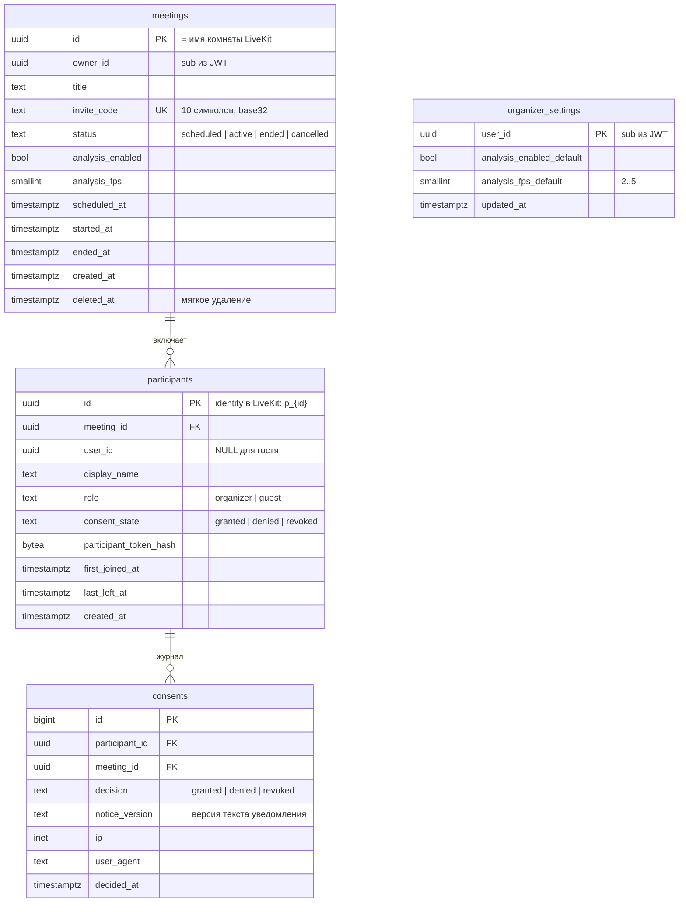
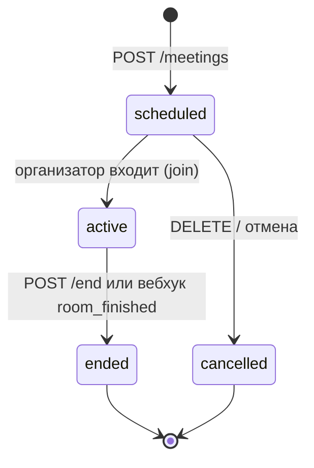
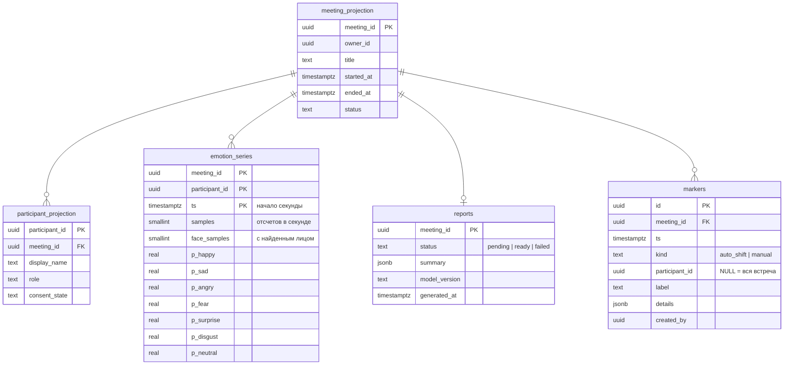

# 4. Модель данных

Один экземпляр PostgreSQL 16, у каждого сервиса своя схема и свой пользователь БД с правами только на нее
([ADR-004](../adr/ADR-004-postgres-schema-per-service.md)). Миграции – Alembic, отдельно в каждом сервисе.
Именование – `snake_case`, первичные ключи – UUID (генерируются в приложении, UUIDv7 для упорядоченности),
время – `timestamptz` в UTC.

Здесь – логическая модель. Физическая схема (DDL, ограничения, индексы, роли, служебные таблицы `outbox`,
`processed_webhooks`, `livekit_sync_queue`, `blocked_users`, `password_reset_tokens`) – в
[backend/database.md](../backend/database.md).

## 4.1 Схема `auth` (auth-service)

## 4.2 Схема `meeting` (meeting-service)

- `consents` – **журнал только для добавления** (append-only), физически без внешних ключей (связь на диаграмме
  логическая), чтобы переживать очистку встреч: подтверждение согласия для HR-сценария и 152-ФЗ.
  Текущее состояние денормализовано в `participants.consent_state`.
- Индексы: `meetings(owner_id, created_at desc)`, `meetings(status)`, `participants(meeting_id)`,
  частичный уникальный `participants(meeting_id, user_id) where user_id is not null`.
- Поиск по истории встреч: `meetings.title` с индексом `pg_trgm` (фильтр по названию и дате).

### Жизненный цикл встречи

Встреча без времени (`scheduled_at = NULL`) создается как `scheduled` и активируется первым входом организатора.

## 4.3 Схема `analytics` (analytics-service)

- `emotion_series` – посекундные средние вероятности (только по отсчетам с найденным лицом).
  Объем: 10 участников × 5 400 с (1,5 ч) = 54 000 строк на встречу ≈ 5 МБ – обычной таблицы с составным
  первичным ключом достаточно; TimescaleDB не требуется.
- `meeting_projection`, `participant_projection` – **проекции**, заполняемые из `meeting.events`;
  используются для проверки прав (`owner_id`) и подписей в отчете без обращения к meeting-service.
- `reports.summary` (JSON) содержит: длительность, распределение эмоций по участникам и по встрече,
  доминирующую эмоцию, долю времени с найденным лицом, список ключевых моментов.

## 4.4 Kafka

| Топик | Владелец | Назначение | Хранение |
|---|---|---|---|
| `emotion.samples` | emotion-ml-service | Отсчеты эмоций | 1 ч |
| `ml.status` | emotion-ml-service | Статус и heartbeat анализа по встречам | 1 ч |
| `meeting.events` | meeting-service | Жизненный цикл встреч, участников, согласий | 7 сут |
| `report.events` | analytics-service | Готовность отчетов | 7 сут |
| `user.events` | auth-service | Блокировка и удаление учетных записей | 7 сут |
| `<топик>.dlq` | потребители | Необработанные сообщения для разбора | 14 сут |

Партиции, ключи, группы потребителей и формат – [api/events.md](../api/events.md).

## 4.5 Redis

Redis не хранит бизнес-данных и событий – только эфемерные служебные ключи (без постоянного хранения на диске).

| Ключ | Тип | Владелец | Назначение | Срок хранения |
|---|---|---|---|---|
| `rt:access:{meeting_id}:{user_id}` | String | realtime-service | Кеш проверки прав | 60 с |
| `auth:ratelimit:{ip}:{email}` | String | auth-service | Ограничение попыток входа | 15 мин |
| `meeting:ratelimit:join:{ip}` | String | meeting-service | Ограничение запросов по ссылкам-приглашениям | 1 мин |
| `idem:{sub}:{key}` | String (JSON) | meeting-service | Ключи идемпотентности `POST /meetings` | 24 ч |
| `jobs:{service}:{job}` | String | все сервисы | Распределенные блокировки фоновых задач | TTL задачи |

## 4.6 Что не хранится

- Аудио, видео и отдельные кадры – нигде (ни в БД, ни на диске, ни в журналах).
- Отсчеты с частотой кадров – только в топике Kafka `emotion.samples` (эфемерно, хранение 1 ч).
- Сообщения чата – только в браузерах участников в течение встречи ([ADR-008](../adr/ADR-008-chat-via-livekit-data.md)).
- Настройки устройств (камера, микрофон, динамики) – в `localStorage` браузера.

## 4.7 Удаление данных

| Действие | Что удаляется |
|---|---|
| Организатор удаляет встречу | meeting-service: мягкое удаление встречи и участников (журнал `consents` хранится 3 года как доказательство согласия, затем удаляется). analytics-service по событию `meeting.deleted`: `emotion_series`, `markers`, `reports`, проекции – физически |
| Удаление учетной записи организатора (админ) | auth-service: пользователь; событие `user.deleted` → удаление встреч и аналитики каскадно по цепочке выше |
| Автоматическая очистка | Отчеты и ряды старше срока хранения (настраивается, по умолчанию 1 год) удаляются ежедневной задачей analytics-service |
