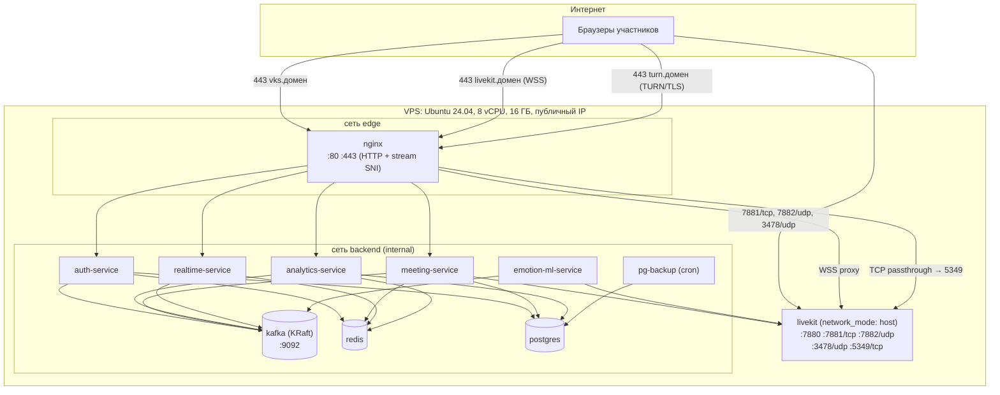

# 6. Развертывание

## 6.1 Диаграмма развертывания

LiveKit работает в `network_mode: host`: для медиатрафика WebRTC это рекомендуемый режим (без NAT Docker и
проброса диапазонов портов). Kafka доступна только во внутренней сети `backend`.

## 6.2 Доменные имена и TLS

| Имя | Назначение | Куда ведет |
|---|---|---|
| `vks.<домен>` | SPA, REST API, WebSocket `/ws` | Nginx → статика / сервисы |
| `livekit.<домен>` | Сигнализация LiveKit (WSS), Server API | Nginx → `127.0.0.1:7880` |
| `turn.<домен>` | TURN/TLS для клиентов за строгими межсетевыми экранами | Nginx `stream` (ssl_preread по SNI) → `127.0.0.1:5349` |

Сертификаты – Let's Encrypt (certbot, контейнер или systemd-таймер), один сертификат на три имени.
Для локальной разработки – `vks.localhost`, самоподписанный сертификат не требуется (браузеры разрешают
`getUserMedia` на `localhost`).

## 6.3 Порты

| Порт | Протокол | Компонент | Открыт наружу |
|---|---|---|---|
| 80 | TCP | Nginx (редирект на HTTPS, ACME) | да |
| 443 | TCP | Nginx (HTTPS, WSS, TURN/TLS по SNI) | да |
| 7881 | TCP | LiveKit ICE/TCP | да |
| 7882 | UDP | LiveKit ICE/UDP (мультиплексированный порт) | да |
| 3478 | UDP | LiveKit TURN/UDP | да |
| 7880 | TCP | LiveKit сигнализация и API | нет (через Nginx) |
| 5349 | TCP | LiveKit TURN/TLS | нет (через Nginx) |
| 9092, 9093 | TCP | Kafka (клиенты, контроллер KRaft) | нет |
| 5432, 6379, 8001–8005 | TCP | БД, Redis, сервисы | нет |

## 6.4 Состав `docker-compose.yml`

Файл: `deploy/docker-compose.yml`; запуск – `docker compose --env-file .env up -d`.

| Сервис compose | Образ | Реплики | Лимиты (MVP, 16 ГБ) | Зависит от |
|---|---|---|---|---|
| `nginx` | `nginx:1.27-alpine` + собранная статика SPA | 1 | 0,5 CPU, 256 МБ | все HTTP-сервисы |
| `auth-service` | `vks/auth-service` | 1 | 0,5 CPU, 256 МБ | postgres, redis, kafka-init |
| `meeting-service` | `vks/meeting-service` | 1 | 0,5 CPU, 256 МБ | postgres, redis, kafka-init, livekit |
| `realtime-service` | `vks/realtime-service` | 1 | 0,5 CPU, 256 МБ | redis, kafka-init |
| `analytics-service` | `vks/analytics-service` | 1 | 1 CPU, 1 ГБ | postgres, redis, kafka-init |
| `emotion-ml-service` | `vks/emotion-ml-service` (CPU) / `…:gpu` | 1 (масштаб до N) | 4 CPU, 4 ГБ | livekit, kafka-init |
| `livekit` | `livekit/livekit-server:v1.x` | 1 | 2 CPU, 2 ГБ | – (host network) |
| `kafka` | `apache/kafka:3.9.x` (KRaft, broker+controller в одном процессе) | 1 | 1 CPU, 1,5 ГБ (`KAFKA_HEAP_OPTS=-Xms768m -Xmx768m`) | – |
| `kafka-init` | `apache/kafka:3.9.x`, скрипт `deploy/kafka/create-topics.sh` | однократно | – | kafka (healthy) |
| `postgres` | `postgres:16-alpine` | 1 | 1 CPU, 2 ГБ | – |
| `redis` | `redis:7-alpine` (без AOF) | 1 | 0,25 CPU, 256 МБ | – |
| `migrate` | образы сервисов, команда `alembic upgrade head` | однократно | – | postgres |
| `pg-backup` | `postgres:16-alpine` + cron | 1 | – | postgres |

Суммарные лимиты ≈ 11,5 ГБ ОЗУ – остается запас для ОС и кеша страниц (важен для Kafka).

Основные параметры брокера (`deploy/kafka/server.properties` или переменные окружения образа):

| Параметр | Значение | Зачем |
|---|---|---|
| `process.roles` | `broker,controller` | Один узел KRaft |
| `listeners` | `SASL_PLAINTEXT://:9092,CONTROLLER://:9093` | В dev – `PLAINTEXT` |
| `auto.create.topics.enable` | `false` | Топики только из `topics.yaml` |
| `default.replication.factor`, `offsets.topic.replication.factor`, `transaction.state.log.replication.factor` | `1` | Один брокер |
| `log.retention.hours` | `168` | По умолчанию; для отдельных топиков – `retention.ms` |
| `log.dirs` | `/var/lib/kafka/data` (том `kafkadata`) | Постоянное хранение |

Профили compose:

- по умолчанию – всё перечисленное;
- `monitoring` – Prometheus, Grafana, Loki + Promtail, `kafka-exporter` (отставание групп потребителей);
- `dev` – `kafka-ui` (просмотр топиков и сообщений, только локально);
- `gpu` – ML-сервис с `deploy.resources.reservations.devices: nvidia` и образом на базе CUDA/`onnxruntime-gpu`.

Масштабирование ML: `docker compose up -d --scale emotion-ml-service=2` – LiveKit Agents распределяет задания
(комнаты) между воркерами автоматически. ML-сервис можно вынести на отдельный узел с GPU: ему нужен сетевой доступ
к LiveKit и Kafka (для внешнего узла – отдельный listener Kafka с TLS).

## 6.5 Конфигурация (переменные окружения)

Шаблон – `deploy/.env.example`. Секреты в репозиторий не коммитятся.

| Переменная | Сервисы | Описание |
|---|---|---|
| `PUBLIC_BASE_URL` | meeting, frontend (сборка) | `https://vks.<домен>` – для ссылок-приглашений |
| `LIVEKIT_URL` | meeting, ml | Адрес LiveKit изнутри контейнеров: `http://host.docker.internal:7880` (LiveKit в host-сети, у сервисов `extra_hosts: host-gateway`) |
| `LIVEKIT_PUBLIC_URL` | meeting | `wss://livekit.<домен>` – отдается клиентам |
| `LIVEKIT_API_KEY`, `LIVEKIT_API_SECRET` | meeting, ml, livekit | Ключ API LiveKit |
| `DATABASE_URL` | auth, meeting, analytics | `postgresql+asyncpg://<svc_user>:…@postgres/vks` (свой пользователь на сервис) |
| `KAFKA_BOOTSTRAP_SERVERS` | все бэкенд-сервисы, ml | `kafka:9092` |
| `KAFKA_SASL_USERNAME`, `KAFKA_SASL_PASSWORD` | все бэкенд-сервисы, ml | Учетная запись SCRAM сервиса |
| `REDIS_URL` | бэкенд-сервисы | `redis://:…@redis:6379/0` |
| `JWT_PRIVATE_KEY_PATH` | auth | Закрытый ключ RS256 (Docker secret) |
| `JWKS_URL` | meeting, realtime, analytics | `http://auth-service:8001/api/v1/auth/.well-known/jwks.json` |
| `SERVICE_TOKEN` | все | Секрет для `/internal/*` |
| `ML_TARGET_FPS`, `ML_MIN_FPS` | ml | Частота анализа (по умолчанию 3 и 2) |
| `ML_SMOOTHING_ALPHA` | ml | Коэффициент EMA (по умолчанию 0,4) |
| `ML_MODEL_PATH`, `ML_DETECTOR_PATH` | ml | Пути к ONNX-файлам (том `models`) |
| `ML_EXECUTION_PROVIDER` | ml | `cpu` \| `cuda` |
| `ANALYTICS_RETENTION_DAYS` | analytics | Срок хранения аналитики (365) |
| `SMTP_*` | auth | Восстановление пароля (доп. функция) |

## 6.6 Порядок первоначального развертывания

1. VPS с Ubuntu 24.04, Docker Engine + Compose plugin; DNS-записи `vks`, `livekit`, `turn` → IP сервера.
2. Открыть порты по таблице 6.3 (ufw).
3. `git clone`, `cp deploy/.env.example deploy/.env`, заполнить секреты; `deploy/scripts/gen-keys.sh` генерирует
   ключ JWT RS256, ключ API LiveKit, пароли БД, Redis и учетных записей Kafka.
4. Получить сертификаты: `deploy/scripts/init-certs.sh`.
5. Загрузить веса моделей в том `models`: `deploy/scripts/fetch-models.sh` (из Releases репозитория).
6. `docker compose up -d` – `kafka-init` создаст топики, учетные записи SCRAM и ACL, `migrate` применит миграции,
   затем стартуют остальные сервисы.
7. Создать администратора: `docker compose exec auth-service vks-auth create-admin --email …`.
8. Проверка: `GET https://vks.<домен>/api/v1/admin/health`, тестовая встреча из двух браузеров, проверка через TURN
   (в Chrome – `chrome://webrtc-internals`, принудительный relay в настройках клиента для тестирования).

Подробные шаги – в руководстве администратора (разрабатывается на этапе 6).

## 6.7 Резервное копирование

- `pg-backup`: ежедневно в 03:00 `pg_dump -Fc vks` → том `backups`, хранение 14 копий; раз в неделю копия выгружается
  на внешнее хранилище (по выбору администратора, `rclone`).
- Восстановление: `deploy/scripts/restore.sh <файл>` (остановка сервисов, `pg_restore --clean`, запуск).
- Kafka не резервируется: источник истины – PostgreSQL, топики хранят события ограниченное время. При потере тома
  `kafkadata` топики пересоздаются `kafka-init`; неопубликованные события остаются в outbox, потеряются только
  отсчеты незавершенных встреч за последние секунды.
- Redis не резервируется: в нем только эфемерные служебные ключи.

## 6.8 Мониторинг и журналы

| Что | Как |
|---|---|
| Состояние сервисов | `GET /health` (liveness) и `GET /ready` (readiness: БД, Redis, Kafka) в каждом сервисе; healthcheck в compose (для Kafka – `kafka-broker-api-versions.sh`) |
| Сводка для администратора | `GET /api/v1/admin/health` (meeting-service агрегирует состояния сервисов, LiveKit, Kafka, heartbeat ML) |
| Метрики | `/metrics` (Prometheus) во всех сервисах; LiveKit – встроенный Prometheus-экспорт; Kafka – `kafka-exporter` |
| Ключевые метрики | число активных комнат и участников, задержка инференса (p50/p95), фактическая частота анализа, отставание групп потребителей Kafka (`kafka_consumergroup_lag`), число сообщений в `*.dlq`, `outbox_pending`, время отклика REST, CPU/RAM контейнеров, заполнение диска `kafkadata` |
| Журналы | JSON в stdout → `docker compose logs`; в профиле `monitoring` – Loki + Grafana |
| Оповещения (опц.) | Grafana alerting: ML heartbeat отсутствует, отставание группы `analytics` > 30 с, новые сообщения в DLQ, диск > 80 % |

## 6.9 Окружения

| Окружение | Где | Особенности |
|---|---|---|
| dev | ноутбук разработчика | `deploy/docker-compose.dev.yml`: LiveKit в `--dev` режиме, Kafka без SASL + `kafka-ui`, горячая перезагрузка сервисов, Vite dev server, ML на CPU |
| test (CI) | GitHub Actions | Сервисы + postgres + redis + kafka через testcontainers; LiveKit – в интеграционных тестах в отдельной job |
| demo (prod) | VPS | Полный compose, TLS, SASL для Kafka, резервное копирование |
