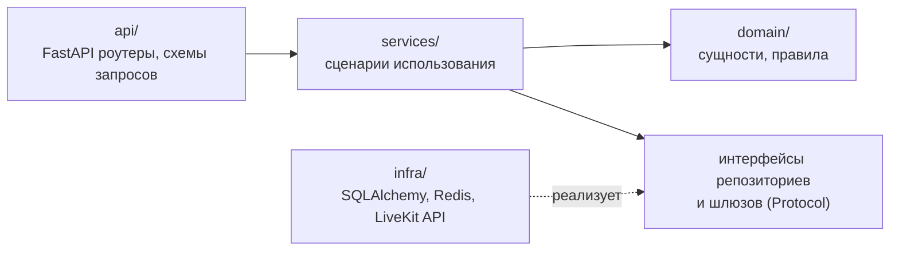

# 7. Разработка: репозиторий, инструменты, стандарты

## 7.1 Структура монорепозитория

```text
ReactiVKS/
├── frontend/                      # SPA: React + TypeScript + Vite
│   ├── src/
│   │   ├── app/                   # корневой компонент, роутер, провайдеры
│   │   ├── pages/                 # страницы (маршруты)
│   │   ├── features/              # auth, meetings, room, emotions, reports, admin, settings
│   │   └── shared/                # api-клиент, ui-компоненты, хуки, типы, legal/
│   ├── public/
│   ├── package.json
│   └── vite.config.ts
├── backend/
│   ├── pyproject.toml             # uv workspace: общие dev-зависимости, ruff, mypy
│   ├── libs/
│   │   ├── vks_common/            # auth (проверка JWT/JWKS), логирование, health, конфиг, клиент Kafka, outbox
│   │   └── vks_contracts/         # pydantic-модели событий шины и внутренних API
│   └── services/
│       ├── auth_service/
│       ├── meeting_service/
│       ├── realtime_service/
│       └── analytics_service/
│           ├── src/analytics_service/
│           │   ├── api/           # роутеры FastAPI (слой представления)
│           │   ├── domain/        # сущности и бизнес-правила без зависимостей от фреймворков
│           │   ├── services/      # сценарии использования (application layer)
│           │   ├── infra/         # репозитории SQLAlchemy, потребители Kafka, внешние клиенты
│           │   ├── main.py
│           │   └── config.py      # pydantic-settings
│           ├── migrations/        # Alembic
│           ├── tests/
│           ├── pyproject.toml
│           └── Dockerfile
├── ml/
│   ├── emotion_service/           # сервис инференса (агент LiveKit)
│   │   ├── src/emotion_service/
│   │   ├── tests/
│   │   ├── pyproject.toml         # зависит от backend/libs/vks_contracts (path-зависимость)
│   │   └── Dockerfile             # варианты cpu / gpu
│   ├── training/                  # обучение и экспорт моделей
│   │   ├── configs/               # YAML-конфигурации экспериментов
│   │   ├── src/fer_training/      # датасеты, модели, обучение, оценка, экспорт ONNX
│   │   ├── notebooks/             # исследовательские ноутбуки
│   │   └── experiments.md         # журнал экспериментов
│   └── models/                    # model_card.json (веса – в Releases / Git LFS, не в git)
├── deploy/
│   ├── docker-compose.yml
│   ├── docker-compose.dev.yml
│   ├── .env.example
│   ├── nginx/                     # конфигурация Nginx (http + stream)
│   ├── livekit/livekit.yaml
│   ├── postgres/init/00-init.sql  # роли и схемы (см. docs/backend/database.md)
│   ├── kafka/                     # server.properties, topics.yaml, create-topics.sh (топики, SCRAM, ACL)
│   ├── monitoring/                # prometheus.yml, дашборды Grafana
│   └── scripts/                   # gen-keys, init-certs, fetch-models, backup, restore
├── docs/
│   ├── architecture/              # уровень Системы
│   ├── adr/                       # архитектурные решения
│   ├── api/                       # контракты: REST, WebSocket, события, LiveKit
│   ├── backend/  ml/  frontend/   # устройство частей
├── .github/workflows/
└── README.md
```

Общий пакет `vks_contracts` – единственное место, где описаны форматы событий. Его используют все сервисы
`backend/` и `ml/emotion_service`; изменение контракта видно в одном pull request со всеми потребителями.

## 7.2 Внутренняя структура Python-сервиса

Слоистая архитектура (упрощенная «чистая архитектура»):



- Зависимости внедряются через `Depends` FastAPI; в тестах подменяются фейками.
- Асинхронный стек: `asyncpg`, `redis.asyncio`, `httpx`.
- Конфигурация – `pydantic-settings` из переменных окружения.

## 7.3 Инструменты

| Область | Инструмент |
|---|---|
| Python | 3.12, менеджер пакетов **uv** (workspace), Ruff (lint + format), mypy (strict для domain/services) |
| Тесты Python | pytest, pytest-asyncio, httpx `AsyncClient`, testcontainers (PostgreSQL, Redis, Kafka), coverage |
| Брокер | `aiokafka` (обертка `vks_common.kafka`); локально – `kafka-ui` для просмотра топиков |
| TypeScript | Node 22 LTS, **pnpm**, ESLint (typescript-eslint, react-hooks), Prettier |
| Тесты frontend | Vitest + Testing Library; Playwright для e2e (две вкладки с фейковой камерой `--use-fake-device-for-media-stream`) |
| API | Контракт описан в `docs/api/rest-api.md`; OpenAPI генерируется FastAPI из кода; типы клиента – `openapi-typescript` (`pnpm gen:api`) |
| БД | Alembic |
| ML | PyTorch, timm, albumentations, OpenCV, ONNX, onnxruntime; Jupyter |
| Контейнеры | Docker, Docker Compose; многоступенчатые Dockerfile, non-root пользователь |
| Pre-commit | `pre-commit`: ruff, prettier, eslint, проверка отсутствия секретов (gitleaks) |

## 7.4 Стандарты кодирования (из концепции, п. 8.5)

- Python – PEP 8, PEP 257, аннотации типов обязательны; форматирование Ruff.
- TypeScript – строгий режим (`strict: true`), ESLint + Prettier, общая конфигурация в `frontend/`.
- Идентификаторы – на английском; комментарии, docstring, документация – на русском.
- БД – `snake_case`, миграции только через Alembic, без ручных изменений схемы.
- REST – ресурсы во множественном числе, `kebab-case` в путях, `snake_case` в JSON, версия `/api/v1`.
- Ошибки REST – единый формат (RFC 9457 Problem Details):
  `{"type": "...", "title": "...", "status": 409, "detail": "...", "code": "meeting_not_started"}`.

## 7.5 Git и процесс

- Модель ветвления **GitHub Flow**: `main` всегда рабочая; ветка на задачу `feat/<id>-short-name`, `fix/…`, `docs/…`.
- Коммиты – **Conventional Commits** с областью = сервис: `feat(meeting): выдача токенов LiveKit`.
- Слияние только через pull request, минимум одно ревью (архитектор принимает код, п. 5.2 устава), зеленый CI.
- Изменение контрактов (`vks_contracts`, REST API, протокол WebSocket, топики Kafka) – обязательно с обновлением `docs/api/*`.

## 7.6 Непрерывная интеграция (GitHub Actions)

| Job | Триггер (paths) | Шаги |
|---|---|---|
| `backend-<service>` | `backend/services/<service>/**`, `backend/libs/**` | ruff, mypy, pytest + coverage (порог 60 %), сборка Docker-образа |
| `ml-service` | `ml/emotion_service/**`, `backend/libs/vks_contracts/**` | ruff, mypy, pytest (на маленькой тестовой модели), сборка образа |
| `frontend` | `frontend/**` | eslint, tsc, vitest, `vite build` |
| `contracts` | `backend/libs/vks_contracts/**`, `docs/api/**` | Проверка совместимости схем событий (генерация JSON Schema и diff) |
| `e2e` | ручной запуск / ночью | `docker compose -f deploy/docker-compose.dev.yml up`, Playwright |
| `release` | тег `v*` | Публикация образов в GHCR |

Риск недоступности GitHub (риск 8 устава): зеркало репозитория в GitVerse/GitLab, workflow-файлы держатся простыми
(`make`-цели), чтобы их было легко перенести.

## 7.7 Стратегия тестирования (архитектурный уровень)

| Уровень | Что проверяется | Инструменты |
|---|---|---|
| Модульные | domain/services сервисов, агрегация рядов, детектор ключевых моментов, сглаживание, препроцессинг кадров | pytest, Vitest |
| Интеграционные | Репозитории + PostgreSQL, производители/потребители + Kafka (outbox, фиксация смещений, DLQ), вебхуки LiveKit (записанные фикстуры) | testcontainers |
| Контрактные | Схемы событий `vks_contracts`, OpenAPI ↔ типы клиента | pydantic JSON Schema, openapi-typescript |
| Сквозные (e2e) | UC-2…UC-5 в двух браузерах с фейковым видео (заранее записанные ролики с эмоциями) | Playwright |
| Нагрузочные | 5 встреч × 10 участников: CPU/RAM, задержка медиа, фактическая частота анализа, задержка панели | `lk load-test` (LiveKit CLI) + ML-агент, метрики Prometheus |
| Качество модели | accuracy, macro-F1, матрица ошибок на тестовой выборке и на записях встреч команды | `ml/training` (скрипт `evaluate`) |
| Сети | Соединение через TURN, ограничение канала | `chrome://webrtc-internals`, `tc netem` |

Задержку панели эмоций измеряет сам фронтенд: разница между `ts` отсчета и временем отрисовки
(часы синхронизируются по `server_time` в сообщении `welcome` протокола WebSocket).
