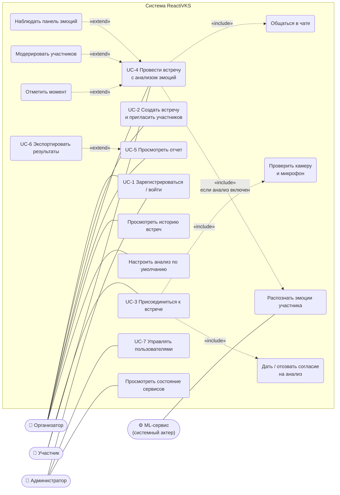
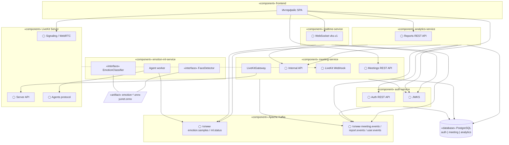
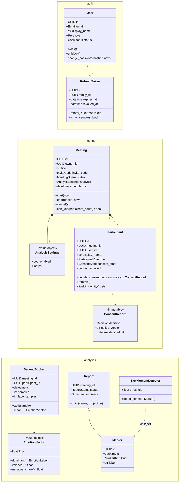
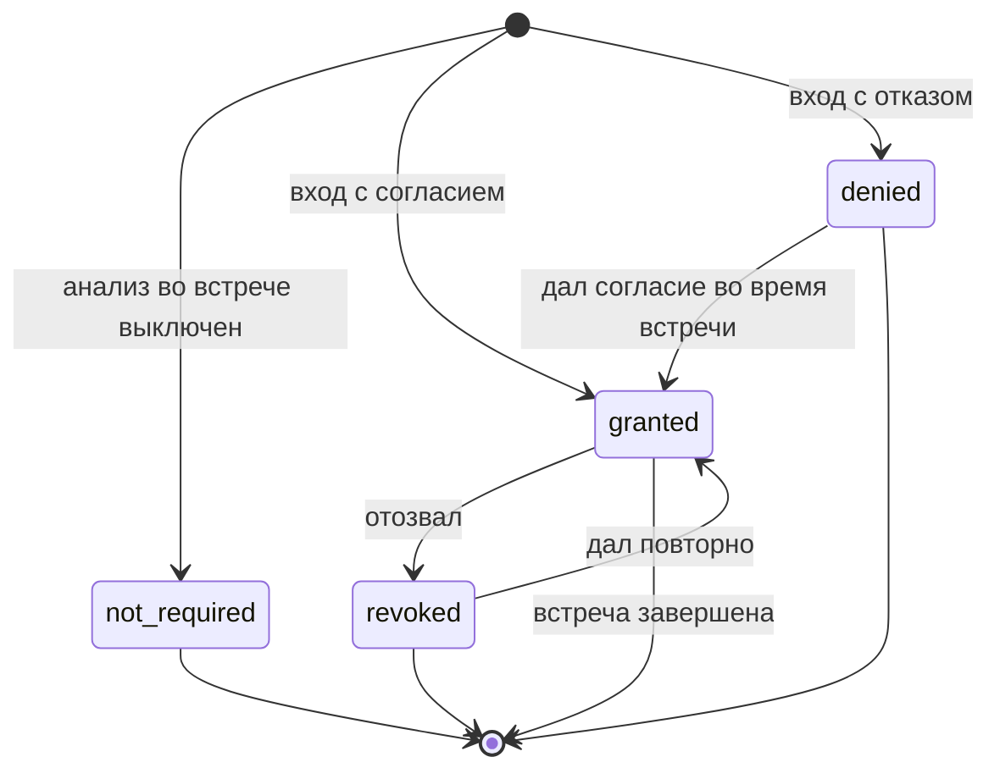
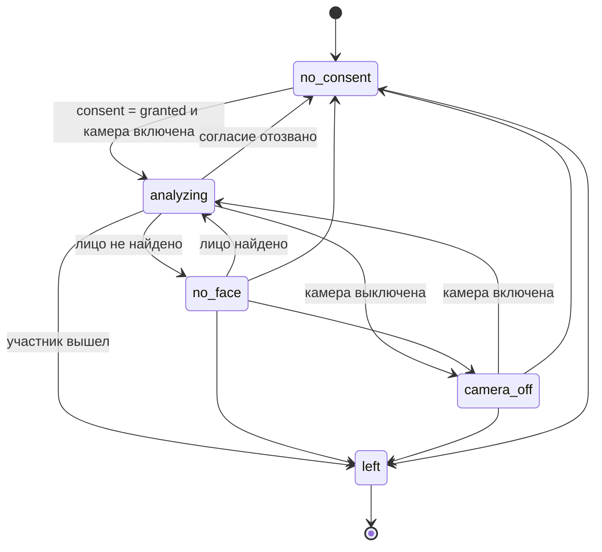
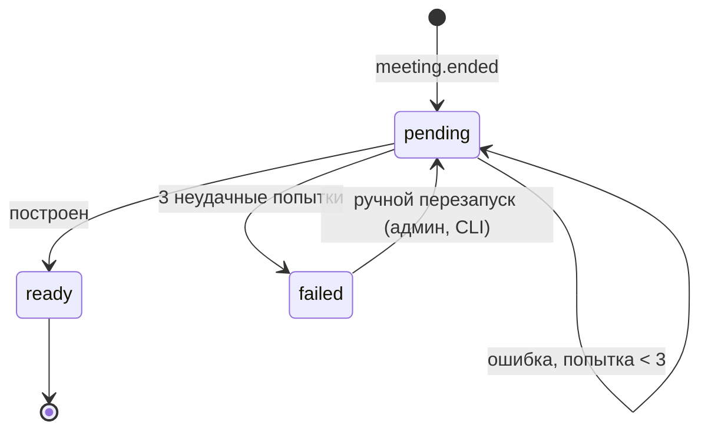

# 9. UML-представления

Сводка диаграмм, которые концепция (п. 8.2) требует для проектирования: прецедентов, компонентов,
последовательности, развертывания; дополнительно – классы предметной области и состояния.
Диаграммы выполнены в Mermaid; нотация UML передана средствами Mermaid (актеры – овалы, прецеденты – скругленные
блоки, интерфейсы компонентов – кружки «◯»).

| Вид UML | Где |
|---|---|
| Прецедентов | [9.1](#91-диаграмма-прецедентов) |
| Компонентов | [9.2](#92-диаграмма-компонентов) |
| Классов (предметная область) | [9.3](#93-диаграмма-классов-предметной-области) |
| Состояний | [9.4](#94-диаграммы-состояний), жизненный цикл встречи – [04-data-model.md](04-data-model.md#жизненный-цикл-встречи) |
| Последовательности | [03-scenarios.md](03-scenarios.md) (UC-1…UC-7), [backend/conventions.md](../backend/conventions.md#6-публикация-событий-transactional-outbox) (outbox) |
| Развертывания | [06-deployment.md](06-deployment.md#61-диаграмма-развертывания) |

## 9.1 Диаграмма прецедентов

Организатор при входе во встречу с анализом также проходит «Дать согласие» (как любой участник, см. открытый
вопрос 4 в [08-implementation-plan.md](08-implementation-plan.md#84-открытые-вопросы)).

## 9.2 Диаграмма компонентов

Предоставляемые интерфейсы обозначены «◯ имя», требуемые – стрелкой к интерфейсу.

## 9.3 Диаграмма классов предметной области

Доменные сущности сервисов (слой `domain/`); сервисы не разделяют классы – связи между контекстами идут через
идентификаторы и события.

## 9.4 Диаграммы состояний

### Согласие участника

### Анализ участника (в ML-сервисе и на панели)

### Отчет

