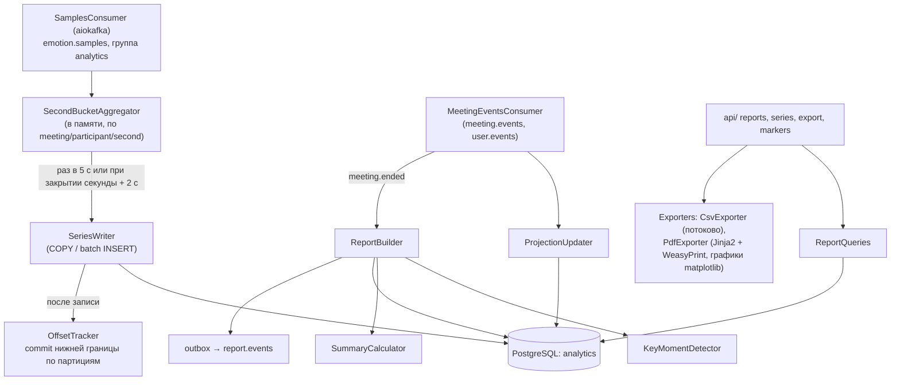

# analytics-service

## Назначение

Сохранение результатов анализа, построение отчета по встрече, экспорт (функции 6.7, 6.9) и удаление аналитики.

## Ответственность

- Потребление топиков Kafka `emotion.samples`, `meeting.events`, `user.events` (группа `analytics`), ведение проекций
  встреч и участников.
- Агрегация отсчетов в посекундные корзины и пакетная запись в `emotion_series`.
- Ручные отметки организатора (`markers`, kind = `manual`).
- Формирование отчета по событию `meeting.ended`: сводка, ключевые моменты (`markers`, kind = `auto_shift`).
- REST API отчетов и рядов; экспорт PDF и CSV.
- Удаление данных по `meeting.deleted`, `user.deleted`; ежедневная очистка по сроку хранения.
- Публикация `report.ready` / `report.failed` в `report.events`.

## Внешний API

| Метод | Путь | Описание |
|---|---|---|
| GET | `/api/v1/reports/{meeting_id}` | Статус и сводка отчета, участники, отметки |
| GET | `/api/v1/reports/{meeting_id}/series` | Ряды: `participant_id?`, `resolution=1s\|5s\|30s`, `since?` (в т. ч. во время встречи) |
| GET | `/api/v1/reports/{meeting_id}/export.csv` | Посекундные вероятности всех участников |
| GET | `/api/v1/reports/{meeting_id}/export.pdf` | PDF-отчет |
| POST | `/api/v1/reports/{meeting_id}/markers` | Ручная отметка `{ts?, label, participant_id?}` (во время и после встречи) |
| DELETE | `/api/v1/reports/{meeting_id}/markers/{id}` | Удалить отметку |

Доступ – только владелец встречи (`meeting_projection.owner_id = sub`).

## Внутренние компоненты

Фиксация смещений `emotion.samples` выполняется только до первого отсчета, чья корзина еще не записана в БД
(`OffsetTracker` хранит для каждой партиции минимальное смещение среди незаписанных корзин). При сбое или
перебалансировке группа дочитывает незаписанные отсчеты с последнего зафиксированного смещения; перед отзывом
партиций при перебалансировке открытые корзины этих партиций принудительно записываются. Запись идемпотентна
(`ON CONFLICT (meeting_id, participant_id, ts) DO UPDATE` с пересчетом среднего по `samples`).

Отсчеты одной встречи находятся в одной партиции (ключ `meeting_id`), поэтому корзины одной встречи обрабатывает
один экземпляр – при нескольких репликах агрегация не требует координации.

Перед построением отчета по `meeting.ended` сервис ждет 5 с и проверяет, что прочитал `emotion.samples` своей партиции
до позиции, соответствующей времени `ended_at` (сравнение `ts` последнего прочитанного отсчета встречи и отставания
партиции); максимум ожидания – 60 с.

## Алгоритмы

### Агрегация
Для каждой секунды: `samples` – все отсчеты, `face_samples` – с найденным лицом; `p_*` – среднее по отсчетам с лицом
(если лиц нет – `NULL`).

### Сводка отчета
- длительность встречи, число участников, доля участников с согласием;
- по участнику: распределение времени по доминирующей эмоции, средние вероятности, доля времени с найденным лицом;
- по встрече: те же показатели, усредненные по участникам (каждый участник с равным весом);
- «эмоциональный фон»: валентность `v = p_happy + 0,5·p_surprise − (p_sad + p_angry + p_fear + p_disgust)`
  (скользящее среднее 10 с).

### Ключевые моменты (`auto_shift`)
Скользящее окно 10 с по встрече и по каждому участнику; момент фиксируется, если доля негативных эмоций
(`sad + angry + fear + disgust`) или валентность изменилась более чем на порог (по умолчанию 0,3) относительно
предыдущих 30 с. Соседние моменты ближе 30 с объединяются. Пороги – в конфигурации.

### Выбор разрешения рядов
`1s` – до 10 мин встречи, `5s` – по умолчанию для графиков, `30s` – обзор. Понижение разрешения выполняется SQL
(`date_bin`).

## Производительность

- Запись: 10 участников × 5 встреч = 50 строк/с → пакет раз в 5 с (≈ 250 строк) – незначительная нагрузка.
- Отчет строится < 5 с для встречи 1,5 ч; PDF < 10 с.
