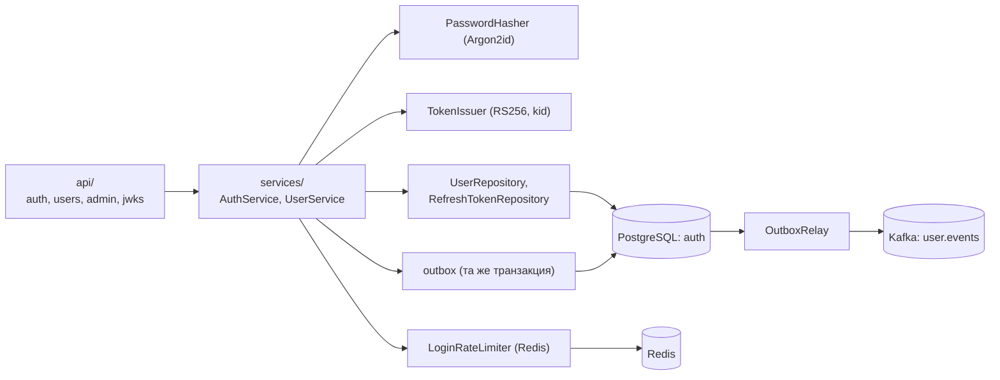
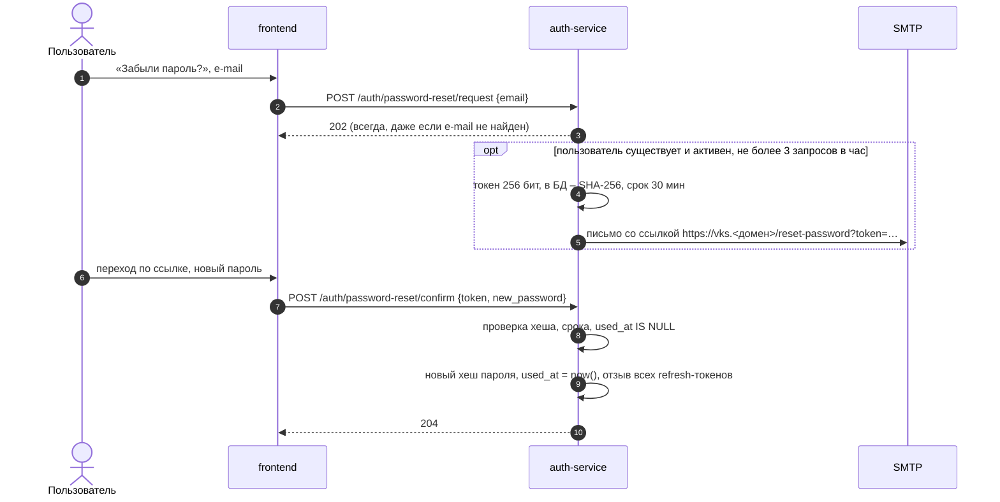

# auth-service

## Назначение

Учетные записи организаторов и администраторов, аутентификация, выпуск JWT, управление пользователями
(администрирование, функция 6.11 в части учетных записей).

## Ответственность

- Регистрация по e-mail и паролю, вход, выход, обновление токенов.
- Выпуск access-токенов JWT RS256 и публикация JWKS.
- Ротация refresh-токенов с обнаружением повторного использования.
- Профиль пользователя (отображаемое имя, смена пароля).
- Администрирование: список пользователей, блокировка/разблокировка, удаление.
- Восстановление пароля по e-mail (дополнительная функция).
- Публикация событий `user.blocked`, `user.unblocked`, `user.deleted` в топик Kafka `user.events` (через outbox).

**Не отвечает** за участников-гостей: их идентификация – в meeting-service.

## Внешний API (через Nginx)

| Метод | Путь | Доступ | Описание |
|---|---|---|---|
| POST | `/api/v1/auth/register` | все | Регистрация (роль `organizer`) |
| POST | `/api/v1/auth/login` | все | Вход → access-токен + refresh-cookie |
| POST | `/api/v1/auth/refresh` | refresh-cookie | Новая пара токенов |
| POST | `/api/v1/auth/logout` | refresh-cookie | Отзыв текущего refresh-токена |
| GET | `/api/v1/auth/.well-known/jwks.json` | все | Публичные ключи |
| GET | `/api/v1/auth/config` | все | Публичные флаги (`registration_enabled`, `password_reset_enabled`) |
| POST | `/api/v1/auth/password-reset/request`, `/confirm` | все | Восстановление пароля (доп.) |
| GET/PATCH | `/api/v1/users/me` | организатор | Профиль |
| POST | `/api/v1/users/me/password` | организатор | Смена пароля |
| GET | `/api/v1/admin/users` | admin | Список, поиск, фильтр по статусу |
| PATCH | `/api/v1/admin/users/{id}` | admin | Блокировка/разблокировка, роль |
| DELETE | `/api/v1/admin/users/{id}` | admin | Удаление учетной записи |

Подробности – [../api/rest-api.md](../api/rest-api.md).

## Внутренние компоненты

## Ключевые правила

- Пароль ≥ 8 символов; хеш Argon2id (`argon2-cffi`, параметры по умолчанию OWASP).
- Ответы на неверный e-mail и неверный пароль одинаковы (`invalid_credentials`).
- Refresh-токены объединены в «семейство» (`family_id`): при повторном предъявлении отозванного токена отзывается
  вся семья (признак кражи).
- Смена пароля и блокировка отзывают все refresh-токены пользователя.
- Ключи подписи: пара RSA 2048; поддерживается несколько ключей в JWKS для ротации (`kid`).
- CLI `vks-auth create-admin` для первичного создания администратора.

## Восстановление пароля (дополнительная функция)

Включается, только если заданы `SMTP_*`; иначе эндпоинты отвечают `404`, а ссылка «Забыли пароль?» на фронтенде
скрывается (флаг `password_reset_enabled` в `GET /api/v1/auth/config`).

Письмо отправляется асинхронно (`aiosmtplib`) после фиксации транзакции; ошибка отправки не раскрывается клиенту.

## Данные

Схема `auth` – [../04-data-model.md](../architecture/04-data-model.md#41-схема-auth-auth-service).

## Нефункциональные характеристики

- Время ответа `login` ≈ 100–300 мс (стоимость Argon2 – сознательная).
- Без состояния в памяти – допускает несколько реплик.
