# Фоновые задачи и потребители событий

Все фоновые работы выполняются внутри процессов сервисов (запуск в `lifespan` FastAPI), отдельного планировщика
(Celery и т. п.) нет. Механизм – `vks_common.jobs`.

## Механизм

| Вид | Как работает |
|---|---|
| **Периодическая задача** | `@job(name, interval=… \| cron=…)`. Перед запуском берется блокировка `SET jobs:<service>:<name> <instance> NX PX <ttl>`; не получил – пропуск. Гарантирует однократное выполнение при нескольких репликах |
| **Непрерывный цикл** | Потребитель Kafka или релей outbox; при нескольких репликах релей тоже берет блокировку (порядок событий), потребители одной группы делят партиции между собой |
| **Отложенная обработка очереди в БД** | `SELECT … WHERE next_attempt_at <= now() ORDER BY id LIMIT n FOR UPDATE SKIP LOCKED` |

Общие правила: каждая задача идемпотентна, ограничена по времени (`timeout`), пишет метрики `job_runs_total{job,result}`,
`job_duration_seconds{job}`; исключение не останавливает цикл (журнал `error`, следующий запуск по расписанию).
Время в cron – UTC.

## auth-service

| Задача | Расписание | Действие |
|---|---|---|
| `outbox-relay` | непрерывно | Публикация `user.events` |
| `purge-refresh-tokens` | ежедневно 02:10 | Удаление refresh-токенов с `expires_at` или `revoked_at` старше 7 дней |
| `purge-reset-tokens` | ежечасно | Удаление использованных и просроченных токенов восстановления пароля |
| `purge-outbox` | ежедневно 02:20 | Удаление опубликованных записей старше 7 дней |

## meeting-service

| Задача | Расписание | Действие |
|---|---|---|
| `outbox-relay` | непрерывно | Публикация `meeting.events` |
| `livekit-sync` | каждую секунду | Обработка `livekit_sync_queue`: `UpdateParticipant`; при ошибке `next_attempt_at = now() + min(2^attempts, 60) с`; для отзыва согласия – не реже раза в секунду. Задача удаляется при успехе или если участник вышел/встреча завершена |
| `reconcile-rooms` | каждые 60 с | Сверка БД с `ListRooms`: встреча `active`, а комнаты нет дольше 2 мин → `ended` (`reason = empty_timeout`); комната есть, а встреча `ended`/`cancelled` → `DeleteRoom` (страховка от потерянных вебхуков) |
| `cancel-stale-meetings` | ежечасно | `scheduled` с `scheduled_at` старше 24 ч → `cancelled` + `meeting.cancelled` |
| `purge-deleted-meetings` | ежедневно 03:10 | Физическое удаление встреч с `deleted_at` старше 30 дней (каскадно – участники) |
| `purge-consents` | ежедневно 03:20 | Удаление записей `consents` старше 3 лет |
| `purge-webhooks` | ежедневно 03:30 | Удаление `processed_webhooks` старше 7 дней |
| `purge-outbox` | ежедневно 03:40 | Как в auth-service |
| Потребитель `user.events` (группа `meeting`) | непрерывно | `user.blocked/unblocked` → `blocked_users`; `user.deleted` → мягкое удаление всех встреч пользователя, завершение активных, `meeting.deleted` на каждую |
| Потребитель `ml.status` (группа `meeting`) | непрерывно | Последний heartbeat ML-воркеров в памяти – для `/admin/health` |

## realtime-service

| Задача | Расписание | Действие |
|---|---|---|
| Потребитель `emotion.samples`, `ml.status`, `meeting.events`, `report.events` (группа `realtime-<HOSTNAME>`) | непрерывно | Маршрутизация в соединения ([realtime-service.md](realtime-service.md)) |
| `batch-flush` | каждые 250 мс | Отправка накопленных `emotion.update` |
| `heartbeat-watch` | каждую секунду | Нет `ml.status` по активной встрече с анализом > 10 с → `analysis.status unavailable` |
| `ws-ping` | каждые 20 с | Закрытие соединений без `ping` > 60 с и с истекшим токеном |

## analytics-service

| Задача | Расписание | Действие |
|---|---|---|
| Потребитель `emotion.samples` (группа `analytics`) | непрерывно | Агрегация в корзины; отсчеты участника со временем позже отзыва согласия отбрасываются |
| `series-flush` | каждые 5 с | Запись закрытых корзин (секунда закрыта > 2 с назад) пакетом, затем фиксация смещений Kafka по нижней границе незаписанных корзин |
| Потребитель `meeting.events`, `user.events` (группа `analytics`) | непрерывно | Проекции; `meeting.ended` → отложенный на 5 с запуск построения отчета; `meeting.deleted` / `user.deleted` → удаление данных |
| `retry-reports` | каждую минуту | `reports.status = pending` дольше 2 мин → повтор построения; после 3 попыток → `failed` + `report.failed` |
| `retention-purge` | ежедневно 04:00 | Удаление аналитики встреч с `ended_at` старше `ANALYTICS_RETENTION_DAYS` |
| `outbox-relay` / `purge-outbox` | непрерывно / ежедневно 04:30 | Публикация `report.events` / очистка |

## Все потребители Kafka

| Задача | Расписание | Действие |
|---|---|---|
| Повтор при временной ошибке | по событию | Пауза партиции и повтор с задержкой до 30 с без продвижения смещения ([conventions.md](conventions.md#7-потребление-событий)) |
| Перенос в DLQ | по событию | Постоянная ошибка или 5 неудачных попыток → `<топик>.dlq`; разбор вручную через `kafka-ui` (dev) или `kafka-console-consumer`, повторная отправка – скриптом `deploy/scripts/dlq-replay.sh` |

## emotion-ml-service

Задачи – это задания LiveKit Agents (по одному на комнату); внутри задания – тактовый цикл анализа и heartbeat
`ml.status` каждые 5 с ([emotion-ml-service.md](../ml/emotion-ml-service.md)).

## Сводка расписания (UTC)

```mermaid
gantt
    dateFormat HH:mm
    axisFormat %H:%M
    section auth
    purge-refresh-tokens  :02:10, 5m
    purge-outbox          :02:20, 5m
    section meeting
    purge-deleted-meetings :03:10, 5m
    purge-consents         :03:20, 5m
    purge-webhooks         :03:30, 5m
    purge-outbox           :03:40, 5m
    section analytics
    retention-purge        :04:00, 20m
    purge-outbox           :04:30, 5m
    section infra
    pg-backup              :03:00, 10m
```

Резервное копирование в 03:00 и задачи очистки meeting-service пересекаются по времени – это допустимо
(`pg_dump` дает согласованный снимок), но тяжелые удаления analytics разнесены на 04:00.
