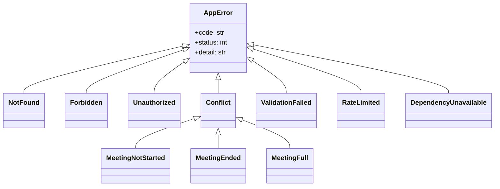
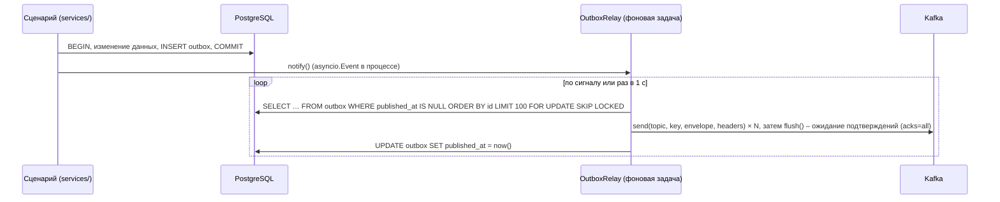

# Соглашения бэкенда

Правила, общие для auth-, meeting-, realtime- и analytics-service. Всё, что здесь описано как механизм,
реализуется **один раз** в `backend/libs/vks_common` и подключается сервисами; сервисы не пишут свои варианты.

## 1. Библиотека `vks_common`

| Модуль | Содержимое |
|---|---|
| `vks_common.app` | Фабрика `create_app(settings, routers, lifespan_hooks)`: middleware, обработчики ошибок, `/health`, `/ready`, `/metrics`, OpenAPI |
| `vks_common.config` | Базовый класс `BaseServiceSettings` (pydantic-settings) |
| `vks_common.auth` | Проверка JWT по JWKS, зависимости FastAPI `require_user`, `require_admin`, `require_service` |
| `vks_common.errors` | Иерархия исключений, реестр кодов ошибок, преобразование в Problem Details |
| `vks_common.http` | Фабрика `httpx.AsyncClient` для внутренних вызовов (таймауты, повторы, заголовки) |
| `vks_common.db` | Движок и фабрика сессий SQLAlchemy 2.0 (async), Unit of Work, базовый репозиторий |
| `vks_common.kafka` | Публикация (`OutboxRelay`, `EventProducer`) и потребление (`EventConsumer`) событий Kafka на `aiokafka` |
| `vks_common.jobs` | Периодические задачи с распределенной блокировкой (см. [background-jobs.md](background-jobs.md)) |
| `vks_common.logging` | Настройка structlog (JSON), контекст `request_id`/`meeting_id` |
| `vks_common.clock` | `Clock` (`now()` в UTC) – подменяется в тестах |
| `vks_common.ids` | `new_id()` → UUIDv7, генерация случайных токенов и `invite_code` |
| `vks_contracts` (отдельный пакет) | Pydantic-модели событий и внутренних API ([events.md](../api/events.md)) |

## 2. Устройство сервиса

Слои и каталоги – [architecture/07-development.md](../architecture/07-development.md#72-внутренняя-структура-python-сервиса).
Дополнительные правила:

- `api/` не содержит бизнес-логики: разбор запроса → вызов сценария из `services/` → формирование ответа.
- Схемы запросов/ответов (`api/schemas.py`) отделены от доменных сущностей (`domain/`) и от моделей ORM (`infra/db/models.py`).
- Сценарий использования = один публичный метод класса в `services/`, одна транзакция.
- Внешние системы (LiveKit, Redis, SMTP, другие сервисы) – только через интерфейсы (`Protocol`) из `services/ports.py`;
  реализации в `infra/`. В тестах – фейки.
- Запуск: `uvicorn <service>.main:app` (1 процесс, асинхронно); фоновые задачи и потребители стартуют в `lifespan`
  того же процесса.

## 3. Конфигурация

- Все настройки – переменные окружения с префиксом сервиса (`MEETING_…`) плюс общие (`DATABASE_URL`, `REDIS_URL`,
  `KAFKA_BOOTSTRAP_SERVERS`, `KAFKA_SASL_USERNAME`/`KAFKA_SASL_PASSWORD`, `JWKS_URL`, `SERVICE_TOKEN`, `ENV`, `LOG_LEVEL`).
- Настройки валидируются при старте; при ошибке сервис не запускается (fail fast).
- Секреты – через Docker secrets (`*_FILE`-переменные читаются `BaseServiceSettings`).
- Значения по умолчанию – безопасные для разработки; для `ENV=production` обязательные секреты не имеют значений
  по умолчанию.

## 4. Ошибки



- Доменные и прикладные слои бросают наследников `AppError`; обработчик в `vks_common.app` превращает их в
  RFC 9457 Problem Details с полем `code`.
- Непредвиденное исключение → `500 internal_error`, в ответе только `request_id`, стек – в журнал.
- Ошибки валидации FastAPI приводятся к тому же формату (`422 validation_error`, поле `errors[]`).
- Реестр кодов – `vks_common.errors.codes` (единый для всех сервисов, дублируется в [rest-api.md](../api/rest-api.md)).
- Чтобы не раскрывать существование ресурса, чужая встреча дает `404`, а не `403`.

## 5. Межсервисные вызовы

| Параметр | Внутренний REST | LiveKit Server API |
|---|---|---|
| Таймаут соединения / чтения | 1 с / 2 с | 1 с / 3 с |
| Повторы | Только идемпотентные (`GET`, `PUT`): 2 повтора, 100 мс → 400 мс, случайный разброс | Идемпотентные операции (`UpdateParticipant`, `DeleteRoom`, `List*`): 2 повтора; `CreateRoom` идемпотентна по имени |
| Заголовки | `X-Service-Token`, `X-Request-ID` (проброс), `User-Agent: <service>/<version>` | Токен LiveKit с нужными грантами |
| Ошибка после повторов | `DependencyUnavailable` (`503`) или деградация (см. ниже) | `503 livekit_unavailable` |

Поведение при недоступности зависимости:

| Вызов | Деградация |
|---|---|
| realtime → meeting `/internal/access` | Если в кеше Redis есть решение – используется; иначе подписка отклоняется `4403`, клиент повторяет |
| analytics → meeting `/internal/meetings/{id}` | Досинхронизация откладывается до следующего события/повтора |
| meeting → LiveKit `UpdateParticipant`, согласие дано | Решение фиксируется в БД, задача ставится в `livekit_sync_queue`, клиенту `202`. Безопасная сторона: пока атрибут не `granted`, ML на видео не подписывается |
| meeting → LiveKit `UpdateParticipant`, согласие отозвано | То же + повтор каждую секунду. До успешной синхронизации: realtime сразу скрывает участника на панели (событие `consent.changed` идет через outbox, без LiveKit), analytics отбрасывает отсчеты участника со временем позже отзыва |

Circuit breaker в MVP не используется: зависимостей мало, таймауты короткие.

## 6. Публикация событий (transactional outbox)



- Сервисы с БД (auth, meeting, analytics) публикуют события **только через outbox**.
- emotion-ml-service публикует напрямую (`EventProducer`): у него нет БД, а отсчеты эфемерны.
- Порядок: релей один на сервис (распределенная блокировка задачи), записи отправляются по возрастанию `id`,
  производитель идемпотентный (`enable.idempotence=true`, `max.in.flight.requests.per.connection ≤ 5`) – порядок внутри
  ключа сохраняется и при повторных отправках.
- Возможен повтор публикации (сбой между `flush()` и `UPDATE`) – потребители идемпотентны по `event_id`.
- Опубликованные записи удаляются задачей очистки через 7 дней.

Параметры производителя (`vks_common.kafka`):

| Параметр | Outbox-релей | ML-сервис (`emotion.samples`) |
|---|---|---|
| `acks` | `all` | `all` |
| `enable_idempotence` | `true` | `true` |
| `linger_ms` | 5 | 20 |
| `compression_type` | `lz4` | `lz4` |
| `request_timeout_ms` | 5000 | 2000 (отсчет, не отправленный вовремя, бесполезен) |
| Ошибка отправки | Запись остается в outbox, повтор на следующем цикле | Отсчет отбрасывается, метрика `ml_publish_errors_total`, `ml.status degraded` при серии ошибок |

## 7. Потребление событий

`EventConsumer(topics, group_id, handler, commit_mode)` на `aiokafka.AIOKafkaConsumer`:

1. `enable_auto_commit=false` (кроме realtime – см. ниже), `auto_offset_reset` – по таблице групп в [events.md](../api/events.md#группы-потребителей),
   `isolation_level=read_committed`, `max_poll_records=500`.
2. Цикл `getmany(timeout_ms=1000)` → пакеты по партициям; сообщения одной партиции обрабатываются **последовательно**
   (сохраняется порядок по ключу), партиции – параллельно.
3. Разбор конверта (`vks_contracts`); неизвестный `type` или несовместимая `version` – пропуск с журналом `warning`.
4. Обработка ошибок:
   - **временная** (БД, Redis, внутренний REST недоступны): повтор с задержкой 0,5 → 1 → 2 → … → 30 с **без продвижения
     смещения** (партиция ставится на паузу `consumer.pause()`); данные не теряются, копятся в Kafka;
   - **постоянная** (ошибка валидации, нарушение инварианта) или 5 неудачных попыток: сообщение с заголовками
     `error`, `failed_at`, `source_topic`, `source_partition`, `source_offset` отправляется в `<topic>.dlq`,
     обработка продолжается (журнал `error`, метрика `consumer_dead_letters_total`).
5. Фиксация смещений – `commit({tp: offset + 1})` после успешной обработки (пакетно, раз в 1 с или 500 сообщений);
   для analytics – по правилу «нижней границы» (см. ниже).
6. `client_id` = имя контейнера (`HOSTNAME`); при перебалансировке (`ConsumerRebalanceListener`) перед отзывом партиций
   сбрасываются накопленные данные и фиксируются смещения.

**Фиксация смещений в analytics-service** (агрегация в посекундные корзины): для каждой партиции хранится минимальное
смещение среди сообщений, чьи корзины еще не записаны в БД; после каждой записи корзин коммитится именно это значение.
При сбое повторно читаются только несохраненные отсчеты.

**realtime-service**: группа на экземпляр (`realtime-<HOSTNAME>`), `auto_offset_reset=latest`, автоматическая фиксация
(`enable_auto_commit=true`) – обработка «не более одного раза», пропущенные данные клиент догружает через REST.

Идемпотентность обработчиков:

| Обработчик | Как обеспечена |
|---|---|
| Проекции (analytics, meeting.blocked_users) | `INSERT … ON CONFLICT DO UPDATE`, сравнение `occurred_at` (старое событие не перетирает новое) |
| Построение отчета | Проверка `reports.status`; повторный вызов для `ready` – без действий |
| Удаление данных | `DELETE` идемпотентен |
| realtime-рассылка | Повтор допустим (клиент перерисует то же значение) |
| Агрегация отсчетов | Коммит смещения после записи корзины; повтор возможен только для окна ≤ 5 с при сбое между `COMMIT` в БД и коммитом смещения – допустимое искажение, фиксируется |

## 8. Доступ к БД

- SQLAlchemy 2.0, `AsyncSession`, драйвер `asyncpg`; пул 5–10 соединений на сервис.
- Сессия на запрос/сообщение; транзакция открывается и фиксируется в сценарии (`async with uow:`).
- Ленивые загрузки запрещены (`lazy="raise"`), связи загружаются явно.
- Репозитории возвращают доменные сущности, а не ORM-объекты.
- Блокировки: изменение статуса встречи – `SELECT … FOR UPDATE` строки встречи (гонки «завершить» vs «вебхук room_finished»).
- Пагинация – курсорная по `(created_at, id)`.

## 9. Идемпотентность HTTP

`POST /meetings` принимает `Idempotency-Key`: ключ + `sub` + хеш тела хранятся в Redis 24 ч вместе с ответом;
повтор с тем же ключом возвращает сохраненный ответ, с другим телом – `409 idempotency_key_reused`.
Остальные изменяющие операции идемпотентны по смыслу (`PUT`, `end`, `remove`, `mute`).

## 10. Health, readiness, метрики

| Эндпоинт | Назначение | Содержимое |
|---|---|---|
| `GET /health` | Liveness (процесс жив) | `{"status": "ok", "service", "version"}` без проверок зависимостей |
| `GET /ready` | Readiness | Проверки с таймаутом 1 с: PostgreSQL (`SELECT 1`), Redis (`PING`), Kafka (метаданные кластера), для meeting – LiveKit (`ListRooms`); `503`, если критичная зависимость недоступна. Недоступность Kafka для auth/meeting – не критична (события копятся в outbox) |
| `GET /metrics` | Prometheus | HTTP (`http_requests_total`, `http_request_duration_seconds`), потребители (`consumer_lag_messages`, `consumer_messages_processed_total`, `consumer_dead_letters_total`), outbox (`outbox_pending`), задачи (`job_runs_total`, `job_duration_seconds`) |

`/health`, `/ready`, `/metrics` не проксируются Nginx наружу.

## 11. Журналирование

- structlog, JSON в stdout; уровни: `debug` (только dev), `info` (бизнес-события: встреча начата/завершена, согласие
  изменено – без ПДн), `warning` (деградация, повторы), `error` (сбои).
- Middleware проставляет `request_id` (из `X-Request-ID` Nginx или новый) и кладет его в контекст;
  `meeting_id`, `user_id` добавляются в контекст сценария.
- `request_id` передается в конверт события (`correlation_id`), потребитель восстанавливает контекст – сквозная трассировка.
- Запреты – [architecture/05-security-privacy.md](../architecture/05-security-privacy.md#56-журналирование).

## 12. Аутентификация в коде

```python
@router.post("/meetings/{meeting_id}/end")
async def end_meeting(meeting_id: UUID, user: CurrentUser = Depends(require_user), svc: MeetingService = Depends()):
    return await svc.end(meeting_id, actor=user)
```

| Зависимость | Проверяет |
|---|---|
| `require_user` | Bearer JWT (подпись, `iss`, `aud`, `exp`), роль `organizer` или `admin` |
| `require_admin` | То же + `role = admin` |
| `require_participant` (meeting-service) | Заголовок `Participant <token>` → поиск по хешу, участник не удален, встреча активна |
| `require_service` | `X-Service-Token` (сравнение `hmac.compare_digest`) |

Проверка владения ресурсом – в сценарии (`services/`), не в роутере.

## 13. Тестирование

| Уровень | Правила |
|---|---|
| Модульные | `domain/` и `services/` с фейками портов; `Clock` фиксирован; без БД и сети |
| Интеграционные | testcontainers PostgreSQL 16, Redis 7 и Kafka (`apache/kafka`, KRaft) – одни контейнеры на сессию pytest, схема пересоздается миграциями, топики – уникальный префикс на тест; транзакция на тест с откатом |
| API | `httpx.AsyncClient(app=…)`, токены подписываются тестовым ключом, JWKS подменяется |
| Контрактные | JSON Schema событий из `vks_contracts` сверяется со снимком в репозитории; изменение снимка – только с обновлением [events.md](../api/events.md) |
| LiveKit | `FakeLiveKitGateway` в модульных; записанные вебхуки как фикстуры; реальный LiveKit (`livekit-server --dev`) – в отдельной интеграционной job |

Порог покрытия – 60 % на сервис (требование концепции), цель для `domain/` и `services/` – 80 %.

## 14. Версионирование API

- Внешний REST – `/api/v1`; обратно совместимые изменения (новые поля, эндпоинты) – без смены версии.
- Несовместимые изменения – `/api/v2` параллельно с `v1` до обновления фронтенда (в учебном проекте – в одном релизе).
- Внутренние API – без версии в пути, меняются вместе с потребителями в одном pull request (монорепозиторий).
