# meeting-service

## Назначение

Центральный сервис плоскости управления: встречи, приглашения, участники, согласия и вся интеграция с LiveKit
(токены, комнаты, модерация, вебхуки, запуск ML-агента). Единственный сервис, который управляет LiveKit через Server API.

## Ответственность

- CRUD встреч организатора; код приглашения; история с поиском и фильтрами (функции 6.2, 6.8).
- Жизненный цикл встречи: `scheduled → active → ended | cancelled`.
- Вход во встречу: организатора (по JWT) и гостя (по коду приглашения) с регистрацией участника.
- Согласие на анализ: прием решения, журнал `consents`, синхронизация атрибута `vks.consent` в LiveKit (функция 6.4).
- Выдача токенов LiveKit с правильными правами и атрибутами.
- Модерация: выключить микрофон/камеру участника, удалить участника (функция 6.3).
- Прием вебхуков LiveKit: `participant_joined`, `participant_left`, `room_finished`.
- Запуск ML-агента в комнате (диспетчеризация LiveKit Agents), если анализ включен.
- Настройки организатора по умолчанию (анализ вкл/выкл, частота) (функция 6.10).
- Администрирование: список активных встреч, агрегированное состояние Системы.
- Публикация событий в топик Kafka `meeting.events` (через outbox); потребление `user.events` (блокировка и удаление
  организатора) и `ml.status` (состояние ML для `/admin/health`) – группа `meeting`.

## Внешний API (через Nginx)

| Метод | Путь | Доступ | Описание |
|---|---|---|---|
| POST | `/api/v1/meetings` | организатор | Создать встречу |
| GET | `/api/v1/meetings` | организатор | Список: `status`, `q`, `from`, `to`, пагинация |
| GET/PATCH/DELETE | `/api/v1/meetings/{id}` | владелец | Карточка / изменение / удаление (отмена) |
| POST | `/api/v1/meetings/{id}/join` | владелец | Войти (и активировать встречу) → токен LiveKit |
| POST | `/api/v1/meetings/{id}/end` | владелец | Завершить встречу |
| GET | `/api/v1/meetings/{id}/participants` | владелец | Участники и их согласие |
| POST | `/api/v1/meetings/{id}/participants/{pid}/mute` | владелец | `{kind: audio \| video}` |
| POST | `/api/v1/meetings/{id}/participants/{pid}/remove` | владелец | Удалить из встречи |
| GET | `/api/v1/join/{invite_code}` | все | Публичная информация о встрече для лобби |
| POST | `/api/v1/join/{invite_code}` | все | Вход гостя → `participant_token`, токен LiveKit |
| PUT | `/api/v1/participants/me/consent` | participant_token | Изменить решение о согласии |
| POST | `/api/v1/participants/me/rejoin` | participant_token | Новый токен LiveKit после перезагрузки вкладки |
| GET/PUT | `/api/v1/settings` | организатор | Настройки анализа по умолчанию |
| GET | `/api/v1/admin/meetings` | admin | Активные/все встречи (без аналитики) |
| GET | `/api/v1/admin/health` | admin | Состояние всех компонентов |
| POST | `/webhooks/livekit` | LiveKit (подпись) | Вебхуки (не через `/api`, доступ только из внутренней сети) |

### Внутренний API

| Метод | Путь | Потребитель | Описание |
|---|---|---|---|
| GET | `/internal/meetings/{id}/access?user_id=` | realtime-service | `{allowed, role}` – владелец ли пользователь |
| GET | `/internal/meetings/{id}` | analytics-service | Досинхронизация проекции (встреча + участники) |

## Внутренние компоненты

```mermaid
flowchart TB
    API["api/: meetings, join, participants,<br/>settings, admin, webhooks, internal"]
    API --> MS["MeetingService<br/>(жизненный цикл)"]
    API --> JS["JoinService<br/>(вход, участники)"]
    API --> CS["ConsentService"]
    API --> MOD["ModerationService"]
    API --> WH["LiveKitWebhookHandler"]
    MS & JS & CS & MOD & WH --> LKG["LiveKitGateway<br/>(RoomService, AgentDispatch, AccessToken)"]
    MS & JS & CS & WH --> REPO["Repositories"]
    MS & JS & CS & WH --> OB["outbox (та же транзакция)"]
    OB --> REL["OutboxRelay"]
    UEC["EventConsumer: user.events,<br/>ml.status (группа meeting)"] --> REPO
    LKG --> LK["LiveKit Server API"]
    REPO --> PG[("PostgreSQL: meeting")]
    REL --> KF[("Kafka: meeting.events")]
    KF2[("Kafka: user.events, ml.status")] --> UEC
```

`LiveKitGateway` – единственная точка зависимости от LiveKit в плоскости управления (требование
заменяемости медиасервера).

## Ключевые правила

- Гость не может войти во встречу со статусом, отличным от `active` (`409 meeting_not_started` / `meeting_ended`).
- Во встречу не более 10 участников одновременно (`max_participants` комнаты LiveKit = 11 с учетом агента) –
  при превышении `409 meeting_full`.
- Если `analysis_enabled = false`, согласие не запрашивается, атрибут `vks.consent = not_required`, агент не запускается.
- Изменение согласия: в одной транзакции – журнал `consents`, `participants.consent_state`, событие `consent.changed`
  в outbox; затем `UpdateParticipant` в LiveKit. Если LiveKit недоступен – задача в `livekit_sync_queue`, клиенту `202`
  (подробно – [conventions.md](conventions.md#5-межсервисные-вызовы), [background-jobs.md](background-jobs.md)).
- Обработка вебхуков идемпотентна (по `event.id`).
- Встреча, активная без участников дольше `empty_timeout` (5 мин), закрывается LiveKit → `room_finished` → `ended`.
- Встреча, запланированная, но не начатая в течение 24 ч после `scheduled_at`, переводится в `cancelled`
  (фоновая задача раз в час).

## Интеграция с LiveKit

Подробно – [../api/livekit-integration.md](../api/livekit-integration.md).

## Данные

Схема `meeting` – [../04-data-model.md](../architecture/04-data-model.md#42-схема-meeting-meeting-service).
