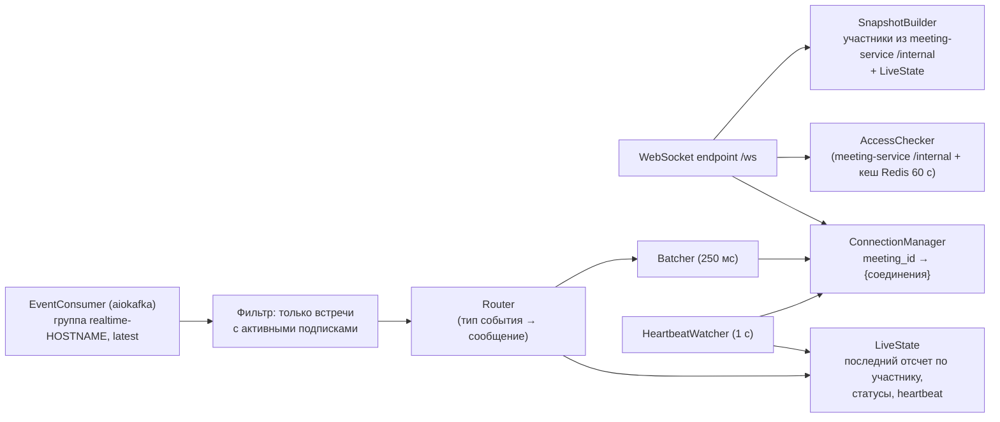

# realtime-service

## Назначение

WebSocket-шлюз для организатора: доставка в реальном времени результатов распознавания эмоций, статусов участников
и анализа, уведомлений о готовности отчета (функция 6.6). Не хранит данных в БД.

## Ответственность

- Прием WebSocket-соединений `wss://vks.<домен>/ws`, аутентификация по JWT.
- Подписка соединения на встречу после проверки, что пользователь – ее организатор.
- Чтение топиков Kafka `emotion.samples`, `ml.status`, `meeting.events`, `report.events` (группа `realtime-<instance>`)
  и рассылка сообщений подписанным соединениям.
- Пакетирование обновлений (не чаще 4 сообщений `emotion.update` в секунду на соединение).
- Отслеживание heartbeat ML по встречам → `analysis.status`.
- Выдача снимка (snapshot) текущего состояния при подписке.

## Внутренние компоненты

## Работа с Kafka

- Группа на экземпляр `realtime-<HOSTNAME>`: каждой реплике нужны все события, так как соединения распределены между
  репликами. Имя группы стабильно между перезапусками контейнера; устаревшие группы удаляются брокером автоматически
  (`offsets.retention.minutes`, по умолчанию 7 сут).
- `auto_offset_reset=latest`, `enable_auto_commit=true` – обработка «не более одного раза»: после перезапуска старые
  отсчеты не нужны.
- `fetch_max_wait_ms=50`, `fetch_min_bytes=1` – минимальная задержка доставки.
- Сообщения по встречам без подписанных соединений отбрасываются до разбора тела (фильтр по ключу `meeting_id`).
- Так как чтение идет с `latest`, при подписке список участников и их состояние согласия берутся не из событий,
  а запросом `GET /internal/meetings/{id}` к meeting-service; дальше поддерживаются событиями.

## Масштабирование

MVP – одна реплика (≤ 5 встреч × 1–2 соединения организатора). Реплики добавляются без изменений кода
(`--scale realtime-service=N`); Nginx распределяет WebSocket-соединения (`ip_hash` не требуется – каждая реплика
получает все события).

## Правила

- Соединение без `auth`/`subscribe` в течение 10 с закрывается (код 4408).
- Истечение access-токена во время соединения: клиент присылает `auth.refresh` с новым токеном; иначе через
  60 с после `exp` соединение закрывается кодом 4401.
- Потерянные при разрыве обновления не досылаются: после переподключения клиент получает snapshot; история
  последних минут на графике восстанавливается из REST analytics (`/series?since=`).
- Недоступность Kafka: heartbeat ML перестает поступать → `analysis.status = unavailable` по всем активным подпискам.

Протокол – [../api/websocket-protocol.md](../api/websocket-protocol.md).
