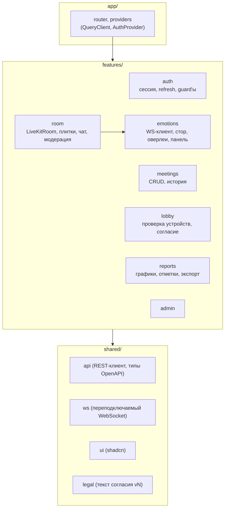

# Клиентская часть (frontend)

## Назначение

Одностраничное приложение для всех ролей: организатор, участник-гость, администратор. Собирается в статические
файлы и раздается Nginx. Интерфейс на русском языке.

Запуск и команды – [frontend/README.md](../../frontend/README.md). Дополнительно:
[заметки по WebRTC и LiveKit](webrtc-livekit-notes.md) · [UI-кит и визуальный стиль](ui-kit.md).

## Технологии ([ADR-006](../adr/ADR-006-frontend-stack.md))

| Задача | Библиотека |
|---|---|
| Основа | React 19, TypeScript (strict), Vite |
| Маршрутизация | React Router |
| Запросы к REST, кеш | TanStack Query; клиент на `fetch` с типами из `openapi-typescript` |
| Локальное состояние | Zustand (сессия, состояние панели эмоций) |
| Видеовстреча | `livekit-client`, `@livekit/components-react` (плитки, устройства, чат) |
| UI-компоненты | shadcn/ui (Radix) + Tailwind CSS |
| Графики | Recharts |
| Формы | React Hook Form + Zod |

## Маршруты

| Путь | Страница | Доступ |
|---|---|---|
| `/login`, `/register` | Вход, регистрация | все |
| `/meetings` | История и запланированные встречи, поиск, фильтры | организатор |
| `/meetings/new` | Создание встречи | организатор |
| `/meetings/:id` | Карточка встречи: ссылка, параметры; для завершенной – отчет | организатор |
| `/room/:meetingId` | Комната организатора (видео + панель эмоций + модерация) | организатор |
| `/j/:inviteCode` | Лобби гостя (устройства, имя, согласие) → комната | все |
| `/settings` | Устройства, анализ по умолчанию, приватность | организатор |
| `/admin` | Пользователи, активные встречи, состояние сервисов | администратор |
| `/dev/ui`, `/dev/livekit` | UI-кит и песочница LiveKit – только в dev-сборке | разработчики |

## Структура модулей

## Работа с аутентификацией

- access-токен хранится в памяти (Zustand), refresh – в httpOnly cookie.
- При старте приложения и при ответе 401 выполняется `POST /auth/refresh` (одновременные запросы ждут одного
  обновления).
- Гость хранит `participant_token` в `sessionStorage` на время встречи (для отзыва согласия и повторного входа
  после перезагрузки вкладки).

## Комната встречи

- `LiveKitRoom` подключается с `livekit_token`; включены `adaptiveStream`, `dynacast`, simulcast (3 слоя для 720p).
- Раскладка «галерея» до 10 плиток; своя плитка – зеркально.
- Чат – компонент чата LiveKit (текстовые потоки LiveKit, тема `lk.chat`); история – только в памяти вкладки.
- Индикатор «Идет анализ эмоций» у всех участников: виден, пока в комнате есть участник с атрибутом
  `vks.kind = agent` (ML-агент). Агент не публикует дорожек и исключается из раскладки плиток и списка участников.
- Кнопка «Анализ моих эмоций: вкл/выкл» у каждого участника → `PUT /participants/me/consent`.
- Модерация организатора (выключить микрофон, удалить) → REST meeting-service.

## Панель эмоций (только организатор)

- `EmotionSocket` подключается к `wss://vks.<домен>/ws`, отправляет `subscribe {meeting_id}`
  ([протокол](../api/websocket-protocol.md)).
- Стор `useEmotionStore`: для каждого участника кольцевой буфер последних 5 минут (≤ 1 500 точек при 5 кадр/с),
  текущее состояние (`dominant`, `confidence`, `state`).
- Отображение:
  - оверлей на плитке: иконка/цвет доминирующей эмоции и процент;
  - боковая панель: карточка на участника (текущая эмоция, мини-график 5 мин), сводка встречи
    (распределение эмоций по всем участникам, доля негативных);
  - статусы: «без анализа» (нет согласия), «лицо не обнаружено», «анализ недоступен»;
  - кнопка «Отметить момент» → `POST /api/v1/reports/{meeting_id}/markers` (ручная отметка для отчета).
- Отрисовка графиков троттлится до 4 раз/с, чтобы не нагружать браузер во время видеовстречи.
- Постоянный дисклеймер о вероятностном характере результатов.

## Отчет

Графики Recharts: стековая площадь вероятностей по времени (на встречу и на участника), круговые/столбчатые
распределения, отметки ключевых моментов на оси времени, таблица участников. Кнопки экспорта PDF/CSV –
прямые ссылки на analytics-service (с access-токеном в заголовке через `fetch` → `Blob`).

## Поддержка браузеров

Chrome, Edge, Яндекс Браузер, Firefox – последние 2 версии; Safari 17+ (для участников). Перед входом – проверка
`RTCPeerConnection`, `getUserMedia` и понятное сообщение при отсутствии поддержки.
