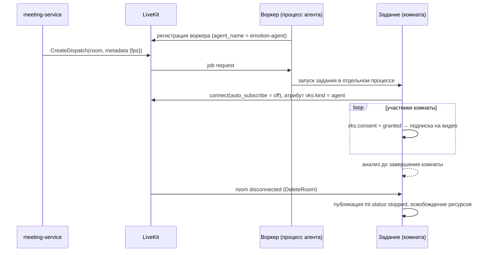
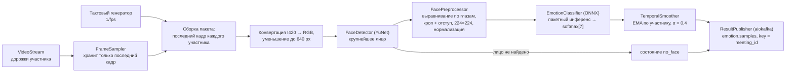

# emotion-ml-service

## Назначение

Сервис анализа: подключается к встрече как служебный участник LiveKit, получает видеодорожки участников, давших
согласие, распознает эмоции (7 классов) и публикует сглаженные результаты в шину событий (функция 6.5).
Не хранит состояния между встречами, не имеет БД и внешнего API (только `/health`, `/metrics`).

## Технологии ([ADR-007](../adr/ADR-007-ml-as-livekit-agent.md))

`livekit-agents` (Python), `livekit` (rtc), NumPy, OpenCV (детектор YuNet), ONNX Runtime (CPU/CUDA),
`aiokafka` (производитель, общий на процесс воркера), `vks_contracts`.

## Жизненный цикл задания



Каждая комната обрабатывается отдельным процессом задания (изоляция сбоев). Модели загружаются один раз в
процессе-«прогреве» воркера (`prewarm`) и разделяются через `fork`/повторную загрузку – решение уточняется на
спайке 2 по потреблению памяти.

## Конвейер обработки



- **Последний кадр выигрывает**: кадры между тактами отбрасываются, очередь не накапливается, поэтому задержка не
  растет при перегрузке, а снижается частота.
- **Адаптивная частота**: если время обработки такта > 80 % периода в течение 5 тактов, частота снижается на 1
  (не ниже `ML_MIN_FPS = 2`), при длительной перегрузке – `ml.status degraded`; при запасе > 50 % –
  частота возвращается к целевой.
- Инференс выполняется в пуле потоков (`asyncio.to_thread`), ONNX Runtime с `intra_op_num_threads` из конфигурации,
  чтобы не блокировать цикл событий, получающий кадры.
- Сглаживание сбрасывается при отзыве согласия, при потере лица > 3 с и при смене дорожки.

## Интерфейсы для замены компонентов

```python
class FaceDetector(Protocol):
    def detect(self, image: np.ndarray) -> list[FaceBox]: ...

class EmotionClassifier(Protocol):
    labels: tuple[str, ...]          # порядок классов из model_card.json
    input_size: tuple[int, int]
    def predict(self, faces: np.ndarray) -> np.ndarray: ...   # (N, 7) вероятности

class ResultSink(Protocol):
    async def publish(self, samples: list[EmotionSample]) -> None: ...
```

Модель подключается по `model_card.json` (архитектура, порядок классов, размер входа, mean/std, метрики, версия).
Новая модель = новый ONNX-файл + карточка, без изменения кода.

## Реакция на согласие

| Событие LiveKit | Действие |
|---|---|
| `participant_connected` / `track_published` (video, camera) | Если `vks.consent = granted` – подписка; иначе отсчет `state = no_consent` (один раз) |
| `participant_attributes_changed` (`vks.consent`) | granted → подписка; revoked/denied → немедленная отписка, сброс состояния, `state = no_consent` |
| `track_muted` (камера выключена) | `state = camera_off`, такты для участника пропускаются |
| `participant_disconnected` | Освобождение ресурсов участника |

Подписка только на дорожки источника `camera` (не `screen_share`), слой simulcast среднего качества (≈ 640×360) –
достаточен для лица и экономит декодирование.

## Публикуемые события

- `emotion.samples` – по одному на участника на такт (формат – [../api/events.md](../api/events.md)).
- `ml.status` – `active` при старте и каждые 5 с (heartbeat), `degraded`, `stopped`.

Публикация в Kafka – напрямую, без outbox: у сервиса нет БД, отсчеты эфемерны. Параметры производителя –
[conventions.md](../backend/conventions.md#6-публикация-событий-transactional-outbox) (`linger_ms=20`, `lz4`,
`request_timeout_ms=2000`). Отправка асинхронная и не блокирует такт анализа; если брокер недоступен, отсчеты
отбрасываются (буфер производителя ограничен), анализ продолжается, а после восстановления публикация возобновляется.

## Приватность

- Кадры существуют только как массивы в памяти одного такта; нет записи на диск, нет журналирования изображений.
- Флаг `ML_DEBUG_DUMP_FRAMES` существует только для локальной отладки на собственных видео команды; при
  `ENV=production` сервис отказывается стартовать с этим флагом.
- Эмбеддинги лиц не вычисляются и не сохраняются; идентификация – только по identity участника LiveKit.

## Производительность (оценка для CPU 4 ядра)

| Этап | На лицо | Пакет 10 лиц |
|---|---|---|
| Декодирование кадра 640×360 (libwebrtc) | ≈ 2 мс | – |
| YuNet 640×360 | ≈ 5–8 мс | ≈ 60 мс |
| Классификатор (MobileNetV3/EfficientNet-B0, 224², ONNX, FP32) | ≈ 8–15 мс | ≈ 60–100 мс |
| **Итого на такт** | | **≈ 130–180 мс** |

При 3 кадрах/с (период 333 мс) одна встреча из 10 участников занимает ≈ 1,5–2 ядра. Для 5 одновременных встреч
на рекомендуемом сервере – GPU или 2 реплики сервиса; на минимальном сервере (8 vCPU) – 1–2 встречи (соответствует
таблице 5 концепции). Цифры проверяются на нагрузочном тестировании.

## Метрики

`ml_tick_duration_seconds` (гистограмма), `ml_effective_fps{meeting}`, `ml_faces_detected_ratio`,
`ml_active_jobs`, `ml_inference_batch_size`, `ml_publish_errors_total`.
