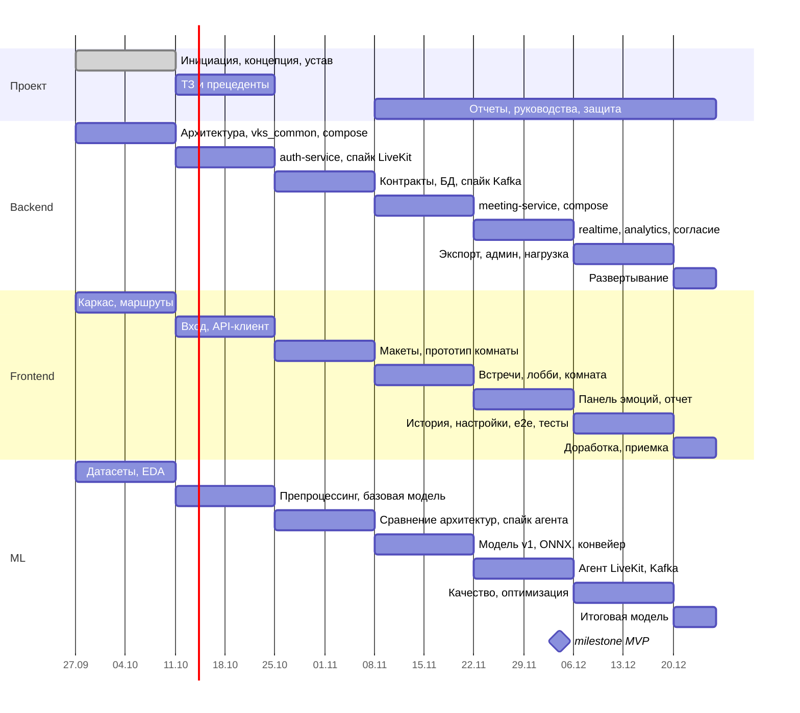

# План разработки по спринтам

Вся разработка (backend, frontend, ML, инфраструктура, документация) разбита на 7 спринтов. План согласован с
этапами устава проекта (раздел 4) и архитектурой ([architecture/](../architecture/)). По каждому спринту
формируется отчет в формате .docx (титульный блок, состав команды, доска задач, оценка в часах, статус задач,
план следующего спринта) – шаблон в корне репозитория («Спринт 1», «Спринт 2»).

## Правила планирования

| Правило | Значение |
|---|---|
| Длительность спринта | 2 недели; спринт 7 – 6 дней (до окончания проекта 25.12.2026) |
| Емкость | 8 ч в неделю на участника (≈ 20 % учебного времени): 16 ч за спринт, 8 ч в спринте 7 |
| Оценка | Estimate point = примерное количество работы в часах |
| Тип задачи | «О» – основная задача по направлению участника (ML, Backend, Frontend); «В» – второстепенная (управление проектом, анализ, документация, дизайн, тестирование, инфраструктура) |
| Ключи задач | `EMO-N`, сквозная нумерация по всем спринтам |
| Статусы | «К выполнению» → «В работе» → «На ревью» → «Готово» |
| Незакрытые задачи | Переносятся в следующий спринт с тем же ключом, план спринта пересматривается |
| Источник истины по задачам | Доска задач; этот раздел – утвержденный базовый план, обновляется на планировании спринта |

## Роли

| Участник | Роли | Основное направление |
|---|---|---|
| Лесовой Артём Евгеньевич | Руководитель проекта, ML Engineer, аналитик, технический писатель | ML |
| Халецкий Дмитрий Евгеньевич | Архитектор, Backend Developer, системный инженер | Backend |
| Зимирев Кирилл Максимович | Frontend Developer, дизайнер, тестировщик | Frontend |

## Спринты

| Спринт | Даты | Этап | Задачи | Емкость команды, ч |
|---|---|---|---|---|
| [1](sprint-1.md) | 27.09.2026 – 10.10.2026 | Этап 1. Инициация и планирование | EMO-1 – EMO-22 | 48 |
| [2](sprint-2.md) | 11.10.2026 – 24.10.2026 | Этап 2. Анализ требований | EMO-23 – EMO-42 | 48 |
| [3](sprint-3.md) | 25.10.2026 – 07.11.2026 | Этап 3. Проектирование | EMO-43 – EMO-60 | 48 |
| [4](sprint-4.md) | 08.11.2026 – 21.11.2026 | Этап 4. Разработка (итерация 1) | EMO-61 – EMO-77 | 48 |
| [5](sprint-5.md) | 22.11.2026 – 05.12.2026 | Этап 4. Разработка (итерация 2), выпуск MVP 04.12.2026 | EMO-78 – EMO-94 | 48 |
| [6](sprint-6.md) | 06.12.2026 – 19.12.2026 | Этап 5. Тестирование и отладка | EMO-95 – EMO-111 | 48 |
| [7](sprint-7.md) | 20.12.2026 – 25.12.2026 | Этап 6. Внедрение и завершение проекта | EMO-112 – EMO-123 | 24 |
| **Итого** | 27.09.2026 – 25.12.2026 | | **123 задач** | **312** |

## Вехи

| Дата | Веха | Спринт |
|---|---|---|
| 10.10.2026 | Утверждены приказ, концепция, устав; зафиксирована архитектура | 1 |
| 24.10.2026 | ТЗ передано на согласование; auth-service и вход работают | 2 |
| 07.11.2026 | Архитектура, API, схема БД, макеты, план тестирования; спайки подтвердили решения | 3 |
| 21.11.2026 | Видеовстреча без анализа (UC-1 – UC-3); модель v1 в ONNX | 4 |
| **04.12.2026** | **MVP: функции 6.1–6.7, демонстрация заказчику** | 5 |
| 19.12.2026 | Все функции первой версии, отчет о тестировании | 6 |
| 25.12.2026 | Развертывание, документация, защита проекта | 7 |

## Распределение по направлениям

## Итоговая трудоемкость

| Участник | Направление | Основные, ч | Второстепенные, ч | Всего, ч |
|---|---|---|---|---|
| Лесовой А.Е. | ML | 60 | 44 | 104 |
| Халецкий Д.Е. | Backend | 77 | 27 | 104 |
| Зимирев К.М. | Frontend | 61 | 43 | 104 |

Плановый объем – 312 ч (устав: ≈ 310 чел.-ч).

## Связь с архитектурой

| Архитектурный результат | Спринт |
|---|---|
| ADR-001…012, описание архитектуры | 1, актуализация – 3 |
| Спайк 1 – LiveKit | 2 |
| Спайк 2 – агент LiveKit на Python; спайк 3 – Kafka и outbox | 3 |
| auth-service | 2, 4 |
| meeting-service | 3 (каркас), 4, 5 (согласие), 6 (админ) |
| realtime-service, analytics-service | 5, 6 (экспорт) |
| emotion-ml-service | 4 (конвейер), 5 (агент, Kafka), 6 (оптимизация) |
| Развертывание и мониторинг | 1 (dev), 4 (compose), 6 (monitoring), 7 (VPS) |

Упрощения при нехватке времени – [architecture/08-implementation-plan.md](../architecture/08-implementation-plan.md#83-приоритеты-при-нехватке-времени).
