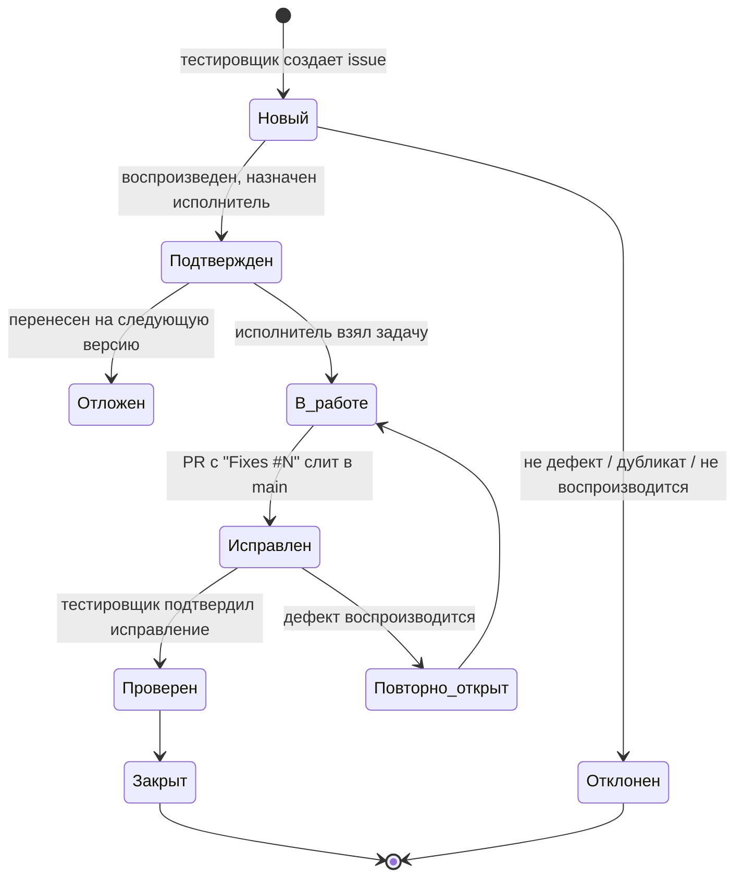

# Журнал дефектов: шаблон и порядок ведения

Результат задачи EMO-21 (спринт 1). Ответственный – тестировщик (Зимирев К. М.).
Журнал входит в отчетную документацию этапа 5 «Тестирование и отладка» (устав, раздел 4).

## 1. Где ведется

| Что | Где | Зачем |
|---|---|---|
| Регистрация и работа с дефектом | **GitHub Issues** репозитория, форма «Дефект» (`.github/ISSUE_TEMPLATE/bug_report.yml`), метка `bug` | Связь с кодом: `Fixes #N` в pull request закрывает дефект автоматически |
| Сводный журнал для заказчика | `docs/testing/defect-log.xlsx` | Приложение к отчету о тестировании и отчетам о статусе; обновляется в конце каждого спринта |

Источник истины – GitHub Issues. Выгрузка для журнала:

```bash
gh issue list --label bug --state all --limit 500 \
  --json number,title,state,labels,assignees,createdAt,closedAt > defects.json
```

## 2. Поля дефекта

| Поле | Правило заполнения |
|---|---|
| ID | `BUG-<номер issue>` (например, `BUG-17`) |
| Заголовок | Что не так и где, одной фразой: «Лобби: кнопка "Войти" активна без выбора согласия» |
| Компонент | `frontend`, `auth`, `meeting`, `realtime`, `analytics`, `ml`, `livekit`, `deploy`, `docs` |
| Прецедент / требование | UC-1…UC-7 или пункт ТЗ, который нарушен |
| Шаги воспроизведения | Нумерованные, с исходными данными; должен воспроизвести любой участник |
| Ожидаемый / фактический результат | Раздельно; ожидаемый – со ссылкой на ТЗ, прецедент или макет |
| Окружение | Браузер и версия, ОС, сеть (прямое соединение / TURN / ограничение канала), commit или версия сборки |
| Вложения | Скриншот, запись экрана, лог консоли; для видеосвязи – дамп `chrome://webrtc-internals` |
| Серьезность | Влияние на Систему, ставит тестировщик (раздел 3) |
| Приоритет | Срочность исправления, ставит руководитель проекта на совещании |
| Исполнитель | Разработчик направления; назначает руководитель проекта |

Запрещено прикладывать записи и кадры с лицами людей, не давших согласия (152-ФЗ): для воспроизведения используются
фейковое видео Chrome или записи участников команды.

## 3. Серьезность

| Уровень | Метка | Критерий | Пример |
|---|---|---|---|
| Блокирующий | `severity:blocker` | Невозможно выполнить основной сценарий, обходного пути нет | Участник не может войти во встречу по ссылке |
| Критический | `severity:critical` | Нарушены безопасность или приватность, потеря данных, нарушено НФТ | Анализ идет без согласия; задержка панели > 2 с |
| Значительный | `severity:major` | Функция работает неправильно, есть обходной путь | Не меняется камера во время встречи, помогает перезаход |
| Незначительный | `severity:minor` | Неудобство, не влияющее на результат | Неверный текст ошибки при входе |
| Тривиальный | `severity:trivial` | Косметика | Отступ на странице отчета |

Блокирующие и критические дефекты исправляются в текущем спринте и не допускаются к выпуску MVP (04.12.2026).

## 4. Жизненный цикл



На GitHub статус отражается меткой `status:*` (или колонкой доски задач); issue закрывается только после
перевода в «Проверен». Отклоненный дефект закрывается с комментарием о причине.

## 5. Порядок работы

1. Тестировщик находит дефект, проверяет, нет ли дубликата, и создает issue по форме «Дефект».
2. На ежедневном статусе / еженедельном совещании руководитель проекта подтверждает дефект, ставит приоритет и
   исполнителя.
3. Исполнитель исправляет в ветке `fix/<номер>-кратко`, в описании PR – `Fixes #N`; к исправлению по возможности
   добавляется автотест, воспроизводящий дефект.
4. После слияния тестировщик повторяет шаги на той же конфигурации и переводит дефект в «Проверен» или «Повторно
   открыт».
5. В конце спринта тестировщик обновляет `defect-log.xlsx` и включает сводку (найдено / исправлено / открыто по
   серьезности) в отчет о статусе проекта.
